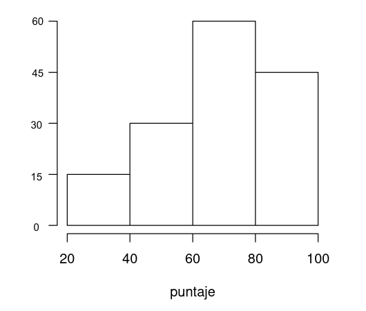
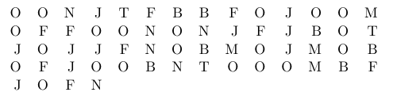
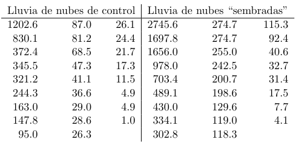
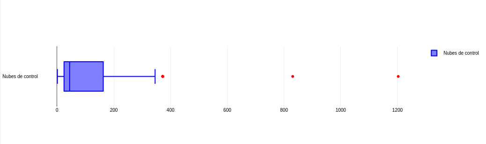
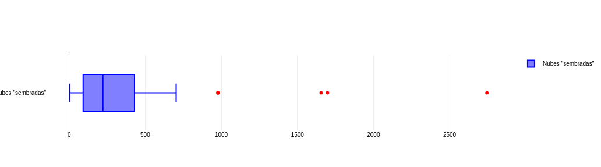

# Ejercicio 1
El histograma que presentamos a continuación muestra la distribución de notas finales obtenidas por los alumnos de una materia. Observar y responder.

<p align="center">
  
</p>

## a
¿Obtuvo algún alumno una puntuación inferior a 20 puntos?

> No

## b
El histograma muestra que un 10% obtuvo notas entre 20 y 40 puntos, ¿qué porcentaje obtuvo notas
entre 40 y 60 puntos?

> El doble que los de entre $20$ y $40$, por ende, $20\%$.

## c
¿Qué porcentaje de alumnos tuvieron notas entre 60 y 80 puntos?

> Idem. $40\%$

## d
¿Qué porcentaje de alumnos superó los 60 puntos?

> $105$ alumnos, que es es $7$ veces $15$, por ende, el $70\%$

# Ejercicio 2
Los datos provienen de un estudio del área de la salud. Las categorías registradas fueron:

<p align="center">
  
</p>

donde: $J = \text{articulación hinchada}$, $F = \text{fatiga}$, $B = \text{dolor de espalda}$, $M = \text{debilidad muscular}$, $T = \text{tos}$, $N = \text{nariz con flujo o irritación}$, $O = \text{otro}$. Obtenga las frecuencias absolutas y relativas para las distintas categorías y realice un gráfico para estos datos.


<div style="width:fit-content; margin: auto">

| Letra |   A   |   R    |
| :---: | :---: | :----: |
|   J   |  10   | 0.1667 |
|   F   |   9   |  0.15  |
|   B   |   7   | 0.1167 |
|   M   |   4   | 0.0667 |
|   T   |   3   |  0.05  |
|   N   |   6   |  0.1   |
|   O   |  21   |  0.35  |
|   -   |  60   | 1.0001 |

</div>

<div style="width:fit-content; margin: auto;">

```vega-lite
{
  "data": {
    "values": [
      {
        "enfermedad": "J",
        "pacientes": 10
      },
      {
        "enfermedad": "F",
        "pacientes": 9
      },
      {
        "enfermedad": "B",
        "pacientes": 7
      },
      {
        "enfermedad": "M",
        "pacientes": 4
      },
      {
        "enfermedad": "T",
        "pacientes": 3
      },
      {
        "enfermedad": "N",
        "pacientes": 6
      },
      {
        "enfermedad": "O",
        "pacientes": 21
      }
    ]
  },
  "mark": "bar",
  "encoding": {
    "x": {    
      "axis": {
        "labelAlign": "right",
        "labelOffset": 4,
        "tickSize": 8
      }, 
      "field": "enfermedad", 
      "type": "ordinal"},
    "y": {"field": "pacientes", "type": "quantitative"}
  },
  "width": 500
}
```

</div>

# Ejercicio 3
Dados los siguientes conjuntos de datos:
- $i)\ 0, 20, 40, 50, 60, 80, 100$
- $ii)\ 0, 48, 49, 50, 51, 52, 100$
- $iii)\ 0, 1, 2, 50, 98, 99, 100$

## a
¿Cuál es el promedio en cada uno de ellos?

- $i)\ \frac {0 + 20 + 40 + 50 + 60 + 80 + 100} {7} = \frac {350} {7} = 50 $
- $ii)\ \frac {0 + 48 + 49 + 50 + 51 + 52 + 100} {7} = \frac {350} {7} = 50 $
- $iii)\ \frac {0 + 1 + 2 + 50 + 98 + 99 + 100} {7} = \frac {350} {7} = 50 $

## b
¿Cuál de ellos presenta una mayor dispersión respecto de la media?

<div style="display: flex; width:fit-content; margin: auto;">

```vega-lite
{
  "title": "i",
  "data": {
    "values": [
      { "i": 1, "Q": 0 },
      { "i": 2, "Q": 20 },
      { "i": 3, "Q": 40 },
      { "i": 4, "Q": 50 },
      { "i": 5, "Q": 60 },
      { "i": 6, "Q": 80 },
      { "i": 7, "Q": 100 }
    ]
  },
  "mark": "bar",
  "encoding": {
    "x": { "field": "i", "type": "ordinal"},
    "y": {"field": "Q", "type": "quantitative"}
  },
  "width": 300
}
```

```vega-lite
{
  "title": "ii",
  "data": {
    "values": [
      { "i": 1, "Q": 0 },
      { "i": 2, "Q": 48 },
      { "i": 3, "Q": 49 },
      { "i": 4, "Q": 50 },
      { "i": 5, "Q": 51 },
      { "i": 6, "Q": 52 },
      { "i": 7, "Q": 100 }
    ]
  },
  "mark": "bar",
  "encoding": {
    "x": { "field": "i", "type": "ordinal"},
    "y": {"field": "Q", "type": "quantitative"}
  },
  "width": 300
}
```

```vega-lite
{
  "title": "iii",
  "data": {
    "values": [
      { "i": 1, "Q": 0 },
      { "i": 2, "Q": 1 },
      { "i": 3, "Q": 2 },
      { "i": 4, "Q": 50 },
      { "i": 5, "Q": 98 },
      { "i": 6, "Q": 99 },
      { "i": 7, "Q": 100 }
    ]
  },
  "mark": "bar",
  "encoding": {
    "x": { "field": "i", "type": "ordinal"},
    "y": {"field": "Q", "type": "quantitative"}
  },
  "width": 300
}
```

</div>

> Queda claro con los gráficos que el de mayor dispersión es $iii)$

## c
¿Cuál de ellos presenta una menor dispersión respecto de la media?

> Cons los gráficos anteriores, concluímos en $ii)$

# Ejercicio 4
Un profesor toma un examen con tres preguntas y asigna un punto a cada una de ellas. Un $30\%$ de la clase consigue $3$ puntos, un $50\%$ $2$ puntos, un $10\%$ $1$ punto y el $10\%$ restante $0$ puntos.

## a
Si la clase se compone de 10 alumnos, ¿cuál es la nota promedio?

$$
\frac {0.3*10 * 3 + 0.5*10*2 + 0.1*10} {10} = \frac {20} {10} = 2
$$

## b
Si la clase se compone de 20 alumnos, ¿cuál es la nota promedio?

$$
\frac {0.3*20 * 3 + 0.5*20*2 + 0.1*20} {20} = \frac {40} {20} = 2
$$

## c
¿Podría decir el valor de la nota promedio sin saber cuántos alumnos hay en la clase?

$$
\frac {0.3n * 3 + 0.5n*2 + 0.1n} n = \frac {n * (0.3*3 + 0.5*2 + 0.1)} n = (0.3*3 + 0.5*2 + 0.1) = 0.9 + 1 + 0.1 = 2
$$

> Sí

# Ejercicio 5
Tres profesores están comparando las notas de los exámenes finales que han tomado. Cada profesor tiene $99$ alumnos. En la clase $A$ un estudiante obtuvo $1$ punto, otro obtuvo $99$ puntos y el resto obtuvieron $50$ puntos. En la clase $B$, $49$ estudiantes lograron una puntuación de $1$, un estudiante logró $50$ puntos y $49$ alumnos llegaron a los $99$ puntos. En la clase $C$, un estudiante logró $1$ punto, otro estudiante $2$ puntos, otro estudiante $3$ puntos y así sucesivamente hasta llegar al estudiante número $99$ que logró $99$ puntos.

## a
¿Hay alguna clase que tenga un promedio de notas superior a las demás o todos son iguales?

- $A$: $\frac {1 + 99 + (\#A - 2)*50} {\#A} = \frac {50*2 + (\#A - 2)*50} {\#A} = \frac {(\#A - 2 + 2)*50} {\#A} = \frac {\#A*50} {\#A} = 50$
- $B$: $\frac {49*1 + 50*1 + 49*99} {\#B} = \frac {50 + 49*(1 + 99)} {99} = \frac {50 + 49*(100)} {99} = \frac {50 + 49* 50 * 2} {99} = \frac {(49 * 2 + 1) * 50} {99} = \frac {99 * 50} {99} = 50$
- $C$: $\frac {\sum _{i=1}^{99} i} {\#C} = \frac {\frac {99^2 + 99} 2} {99} =  \frac {99(99 + 1)} 2 \frac 1 {99} = \frac {100} 2 = 50$

> Todas tienen el mismo promedio.

## b
¿Hay alguna clase que tenga una desviación estándar de notas superior a las demás o todas son iguales?

<div style="display: flex; width:fit-content; margin: auto;">

```vega-lite
{
  "title": "A",
  "data": {
    "values": [
      { "i": 1, "Q": 1 },
      { "i": 2, "Q": 50 },
      { "i": "...", "Q": 50 },
      { "i": 98, "Q": 50 },
      { "i": 99, "Q": 99 }
    ]
  },
  "mark": "bar",
  "encoding": {
    "x": { "field": "i", "type": "ordinal"},
    "y": {"field": "Q", "type": "quantitative"}
  },
  "width": 300
}
```

```vega-lite
{
  "title": "B",
  "data": {
    "values": [
      { "i": 1, "Q": 1 },
      { "i": 2, "Q": 1 },
      { "i": "...", "Q": 0 },
      { "i": 48, "Q": 1 },
      { "i": 49, "Q": 1 },
      { "i": 50, "Q": 50 },
      { "i": 51, "Q": 99 },
      { "i": 52, "Q": 99 },
      { "i": "---", "Q": 0 },
      { "i": 98, "Q": 99 },
      { "i": 99, "Q": 99 }
    ]
  },
  "mark": "bar",
  "encoding": {
    "x": { "field": "i", "type": "ordinal"},
    "y": {"field": "Q", "type": "quantitative"}
  },
  "width": 300
}
```

```vega-lite
{
  "title": "C",
  "data": {
    "values": [
      { "i": 1, "Q": 1 },
      { "i": 2, "Q": 2 },
      { "i": "...", "Q": 0 },
      { "i": 49, "Q": 49 },
      { "i": 50, "Q": 50 },
      { "i": 51, "Q": 51 },
      { "i": "---", "Q": 0 },
      { "i": 98, "Q": 98 },
      { "i": 99, "Q": 99 }
    ]
  },
  "mark": "bar",
  "encoding": {
    "x": { "field": "i", "type": "ordinal"},
    "y": {"field": "Q", "type": "quantitative"}
  },
  "width": 300
}
```

</div>

> La clase $B$ tiene una desviación notablemente superior al resto de clases.

# Ejercicio 6
El articulo cientifico “The Pedaling Technique of Elite Endurance Cyclists” (Int. J. Sport Biomechanics, 1991, pp. 29-53) reporto los siguientes datos sobre fuerza en una sola pierna para carga pesada de trabajo:

$$
\begin{gather*}
160 & 174 & 176 & 177 & 179 & 180 & 180 & 181 & 183 & 187 \\
191 & 194 & 200 & 202 & 204 & 205 & 207 & 211 & 211 & 254
\end{gather*}
$$

## a
Calcule e interprete la media y mediana muestrales.

> La mediana es $\frac {187+191} 2 = 189$ y la media $\frac 1 {20} \sum _{i=1} ^{20} d_i = \frac {3856} {20} = 192.8$.

## b
Suponga que la ultima observación fue 211 en vez de 254. ¿Cómo cambiarían la media y la mediana?

> La mediana se mantiene ya que se cambió un valor que estaba por encima de ella por otro que sigue estando por encima. Y la media decrese: $192.8 + \frac {-254 + 211} {20} = 190.65$

## c
La media muestral $α$-recortada consiste en calcular el promedio muestral excluyendo de la muestra el $α\%$ de las observaciones mas pequenas y el $α%$ de las mas grandes.
Calcule una media recortada eliminando las observaciones mínima y maxima de la muestra. ¿Cual es el porcentaje correspondiente de recorte?

> Es el 5%, ya que se saca un elemento por lado, $\frac 1 {20} = 0.05$.

## d
Calcule la media muestral $20\%$ recortada.

> La media muestral recortada por $20\%$ es $\frac 1 {12} \sum _{i=4} ^{16} d_i = \frac {2286} {12} = 190.5$, ya que el $20\%$ de $20$ es $4$, o sea que se sacan $8$ elementos en total.

## e
También, el artículo presenta valores de la potencia de una sola pierna para el ejercicio liviano. La media muestral para $n = 19$ observaciones fue $119.8$, y la vigésima observación, algo apartada, fue $159$.
¿Cuál es el valor de la media muestral para toda la muestra?

> Pasamos de la media al absoluto acumulado multiplicando por la logitud del espacio muestral, sumamos la nueva observación y dividimos por la nueva longitud: $\frac {119.8 * 19 + 159} {20}= 121.76$ 

# Ejercicio 7
En una fabrica automotriz se quiere evaluar la resistencia de los automóviles a una prueba de choque a una velocidad de $5$ millas por hora. Se considera un éxito $(E)$ si el| automovil no presenta daños visibles despues de la prueba, y fracaso $(F)$ en caso contrario. Se somete a la prueba a diez automóviles y se obtienen los siguientes resultados: $E\ E\ F\ E\ E\ E\ F\ F\ E\ E$

## a
Si denotamos con $x$ el número de éxitos en la muestra, ¿Cuál es el valor de la proporción muestral $\frac x n$?

> Valor de la proporcion muestral $\frac 7 {10} = 0.7$

## b
Sustituya cada $E$ con un $1$ y cada $F$ con un $0$. Luego, calcule $x$ para esta muestra numericamente codificada. ¿Cómo se compara $\overline x$ con $\frac {\overline x} n$?

> Tenemos $\overline x = 3$, y $\frac 3 {10}= 0.3$ que son el complemento de $x$ y de $\frac x n$ respectivamente.

## c
Suponga que se decide incluir $15$ automóviles más en el experimento. ¿Cuántos de éstos deberían ser $E$ para obtener $\frac x n = 0.80$ para toda la muestra de $25$ automóviles?

> Calculamos:
> $$
\begin{gather*}
\frac {7*1 + y} {25} &=& 0.8 \\
7 + y &=& 0.8 * 25 \\
y &=& 20 - 7 \\
y &=& 13 \\
\end{gather*}
$$
> Se necesita que $13$ de los $15$ autos nuevos sean exitosos para que la media sea $0.8$.

# Ejercicio 8
## a
Sean $a$ y $b$ dos constantes y sea $y_i = ax_i + b$ para $i = 1, 2, ..., n$. ¿Cuáles son las relaciones entre $x$ e $y$? y ¿entre $s^2_x$ y $s^2_y$?

$$ 
\begin{gather*}
y_1+...+ y_n = ax_1+b+ ... + ax_n + b \\
y_1+...+ y_n = a(x_1 + ... + x_n)+b*n \\
\frac{y_1+...+ y_n}{n} = a \frac {(x_1 + ... + x_n)} n +b \\
\bar y = a \bar x + b
\end{gather*}
$$ 
$$
\begin{gather*}
\frac{1}{n} \sum_1^n (y_i - \bar{y})^2 = \frac{1}{n} \sum_1^n (a*x_i+b - (a \bar x + b))^2\\ \\
\frac{1}{n} \sum_1^n (y_i - \bar{y})^2 = \frac{1}{n} \sum_1^n (a(x_i - \bar x))^2\\ \\
\frac{1}{n} \sum_1^n (y_i - \bar{y})^2 = \frac{a^2}{n} \sum_1^n (x_i - \bar x)^2\\ \\
S_y^2 = a^2S_x^2
\end{gather*}
$$

## b
El artículo científico _”Penicillin in the treatment of meningitis”_ reportó las temperaturas del cuerpo, en grados Fahrenheit, de pacientes hospitalizados con meningitis. Diez de las observaciones fueron: $104.0, 104.8, 101.6, 108, 103.8, 100.8, 104.2, 100.2, 102.4$ y $101.4$.

### i
Calcular el promedio y desvío estándar muestral.

- El promedio es 103.12 y el desvio estandar muestral es

$$
\begin{gather*}
\sqrt {\frac{1}{10} \sum_1^{10} (x_i - 103.12)^2} &=& \sqrt {\frac{1}{10} (0.7744 + 2.8224 + 2.3104 + 23.8144 + 0.4624 + 5.3824 + 1.1664 + 8.5264 + 0.5184 + 2.9584)}\\ \\
&=& \sqrt {\frac 1 {48.736}} \\ \\
&=& \sqrt {4.8736} \\ \\
&=& 2.2076
\end{gather*}
$$

### ii
¿Cuánto vale el promedio y el desvío estándar muestral de los datos expresados en grados Celcius (0C)?
> Ayuda: La relación que existe entre ambas escalas de temperaturas está dada por: $T_C = (T_F − 32)\frac 5 9$.

$$
\begin{gather*}
T_C(\bar x) &=& \frac 5 9 \bar x - 32 \frac 5 9 \\
T_C(103.12) &=& \frac 5 9 103.12 \ - 17.78 \\
&=& 57.29 - 17.78 \\
&=& 39.51 \\
\\
\sqrt {\frac{1}{10} \sum_1^{10} (x_i - \bar x)^2} &=& 2.2076 \\
ST_C(x) &=& \frac 5 9 S_x \\
&=& \frac 5 9 2.2076 \\
&=& 1.22644 \\
\end{gather*}
$$

### iii
Una muestra de temperaturas para iniciar cierta reacción química, medidas en grados Celcius ($°C$), generó un promedio muestral igual a $87.3°C$ y una desviación estándar muestral igual a $1.04°C$. ¿Cuánto vale el promedio y el desvío estándar muestral de los datos expresados en grados Fahrenheit?

$$
\begin{gather*}
T_F(x) &=& \frac 9 5 x + 32 \\
T_F(87.3) &=& \frac 9 5 87.3 + 32 \\
&=& 157.14 + 32 \\
&=& 189.14 \\
\\
ST_C(x) &=& \frac 9 5 S_x \\
&=& \frac 9 5 1.04 \\
&=& 1.872 \\
\end{gather*}
$$

# Ejercicio 9
Decir si son verdaderas o falsas las siguientes afirmaciones y justifique su respuesta.

## a
Si suma $7$ a cada uno de los datos de un conjunto entonces el promedio aumenta $7$ puntos.

$$
\begin{gather*}
\frac {\sum _{i=1} ^n (x_i + 7)} n &=& \frac {\sum _{i=1} ^n x_i + \sum _{i=1} ^n 7} n \\
&=& \frac {\sum _{i=1} ^n x_i + 7*n} n \\
&=& \frac {\sum _{i=1} ^n x_i} n + \frac {7*n} n \\
&=& \frac {\sum _{i=1} ^n x_i} n + 7 \\
&=& promedio + 7 \\
\end{gather*}
$$

## b
Si suma $7$ a cada uno de los datos de un conjunto entonces la desviación estándar aumenta $7$ puntos.

$$
\begin{gather*}
\sqrt{\frac 1 n \sum _{i=1} ^n ((x_i + 7) - (\overline x + 7))^2} &=& \sqrt{\frac 1 n \sum _{i=1} ^n (x_i - \overline x)^2} \\
&=& DevEst \\
\end{gather*}
$$

> Falso, la desviación estandar se mantiene.

## c
Si dobla el valor de cada dato de un conjunto entonces el promedio dobla su valor.

$$
\begin{gather*}
\frac {\sum _{i=1} ^n (2x_i)} n &=& 2\frac {\sum _{i=1} ^n x_i} n \\
&=& 2 * promedio
\end{gather*}
$$

## d
Si dobla el valor de cada dato de un conjunto entonces la desviación estándar dobla su valor.

$$
\begin{gather*}
\sqrt{\frac 1 n \sum _{i=1} ^n ((2x_i) - (2*\overline x))^2} &=& \sqrt{\frac 1 n \sum _{i=1} ^n (2(x_i - \overline x))^2} \\
&=& \sqrt{\frac 1 n \sum _{i=1} ^n (4*(x_i - \overline x)^2)} \\
&=& \sqrt{\frac 1 n * 4 * \sum _{i=1} ^n (x_i - \overline x)^2} \\
&=& 2 \sqrt{\frac 1 n \sum _{i=1} ^n (x_i - \overline x)^2} \\
&=& 2 * DesvEst \\
\end{gather*}
$$

## e
Si cambia el signo de cada dato de un conjunto entonces el promedio cambia de signo.

$$
\begin{gather*}
\frac {\sum _{i=1} ^n (-x_i)} n &=& -\frac {\sum _{i=1} ^n x_i} n \\
&=& - promedio
\end{gather*}
$$

## f
Si cambia el signo de cada dato de un conjunto entonces el desvío estándar cambia el signo.

$$
\begin{gather*}
\sqrt{\frac 1 n \sum _{i=1} ^n ((-x_i) - (-\overline x))^2} &=& \sqrt{\frac 1 n \sum _{i=1} ^n (-(x_i - \overline x))^2} \\
&=& \sqrt{\frac 1 n \sum _{i=1} ^n (x_i - \overline x)^2} \\
&=& DesvEst \\
\end{gather*}
$$

> Falso, la desviación estandar se mantiene.

# Ejercicio 10
Sean $v_1, v_2, ..., v_n$ las observaciones obtenidas de un experimento. La media muestral resulta $\bar v$ y el correspondiente desvió estándar resulta $s_v$.

## a
Si $u_i = v_i − \bar v$ para $i = 1, ..., n$. ¿Qué relación existe entre las medias muestrales y los desvíos estándar muestrales de $u$ y $v$?

$$
\begin{gather*}
\begin{gather*}
\bar v &=& \frac 1 n \sum_{i=1} ^n v_i \\
\\
\bar u &=& \frac 1 n \sum_{i=1} ^n (v_i - \bar v) \\
&=& \frac 1 n \left(\sum_{i=1} ^n (v_i) - \bar v * n\right) \\
&=& \frac 1 n \sum_{i=1} ^n v_i - \bar v \\
&=& \bar v - \bar v \\
&=& 0 \\
\end{gather*} \\ \\
\begin{gather*}
s_v &=& \sqrt {\frac 1 n \sum_{i=1} ^n (v_i - \bar v)^2} \\
&=& \sqrt {\frac 1 n \sum_{i=1} ^n (u_i)^2} \\
\\
s_u &=& \sqrt {\frac 1 n \sum_{i=1} ^n (u_i - \bar u)^2} \\
&=& \sqrt {\frac 1 n \sum_{i=1} ^n (u_i)^2} \\
&=& s_v \\
\end{gather*}
\end{gather*}
$$

## b
Si $z_i = \frac{(v_i − \bar v)} {s_v}$ para $i = 1, . . . , n$. ¿Qué relación existe entre las medias muestrales y los desvíos estándar muestrales de $z$ y $v$?

$$
\begin{gather*}
\begin{gather*}
\bar v &=& \frac 1 n \sum_{i=1} ^n v_i \\
\\
\bar z &=& \frac 1 n \sum_{i=1} ^n z_i \\
&=& \frac 1 n \sum_{i=1} ^n \left(\frac{(v_i − \bar v)} {s_v} \right) \\
&=& \frac 1 n * \frac 1 {s_v} * \sum_{i=1} ^n (v_i − \bar v) \\
&=& \frac 1 n * \frac 1 {s_v} * \left(\sum_{i=1} ^n v_i - \sum_{i=1} ^n \bar v \right) \\
&=& \frac 1 {s_v} * \left(\frac 1 n \sum_{i=1} ^n v_i - \frac 1 n \sum_{i=1} ^n \bar v \right) \\
&=& \frac 1 {s_v} * \left(\bar v - \frac 1 n \bar v * n \right) \\
&=& \frac 1 {s_v} * (\bar v -  \bar v) \\
&=& \frac 1 {s_v} * 0 \\
&=& 0
\end{gather*} \\ \\
\begin{gather*}
s_v &=& \sqrt {\frac 1 n \sum_{i=1} ^n (v_i - \bar v)^2} \\
s_v^2 &=& \frac 1 n \sum_{i=1} ^n (v_i - \bar v)^2 \\
n &=& \frac 1 {s_v^2} \sum_{i=1} ^n (v_i - \bar v)^2 \\
&=& \sum_{i=1} ^n \left(\frac 1 {s_v^2} (v_i - \bar v)^2 \right) \\
&=& \sum_{i=1} ^n \left(\frac {v_i - \bar v} {s_v} \right)^2 \\
&=& \sum_{i=1} ^n (z_i)^2 \\
\\
s_z &=& \sqrt {\frac 1 n \sum_{i=1} ^n (z_i - \bar z)^2} \\
&=& \sqrt {\frac 1 n \sum_{i=1} ^n (z_i)^2} \\
\\
s_v &=& \sqrt {\frac 1 n \sum_{i=1} ^n (v_i - \bar v)^2} \\
&=& \sqrt {\frac 1 n \sum_{i=1} ^n (s_v z_i)^2} \\
&=& \sqrt {\frac 1 n \sum_{i=1} ^n (s_v^2z_i^2)} \\
&=& \sqrt {\frac 1 n s_v^2 \sum_{i=1} ^n (z_i^2)} \\
&=& s_v \sqrt {\frac 1 n \sum_{i=1} ^n (z_i^2)} \\
&=& s_v s_z \\
\\
s_v \ne 0 &\Rightarrow& s_z = 1
\end{gather*}
\end{gather*}
$$

# Ejercicio 11
En un artículo publicado en la revista Technometrics se reportan los resultados de experimentos en los que se registran las precipitaciones pluviales (expresados en mm.) correspondientes a nubes naturales y “sembradas” artificialmente con centros de condensación. Los resultados reportados se transcriben en la tabla ordenados de mayor a menor.

<p align="center">
  
</p>

## a
Para los valores de lluvia, de cada grupo, hallar el máximo, el mínimo, el rango o amplitud, la media, la mediana, el desvío estándar y los cuartiles.

- _Nubes de control_:
  - __Max__: $1202.6$
  - __Min__: $1.0$
  - __Rango__: $1201.6$
  - __Media__: $164.6077$
  - __Mediana__: $44.2$
  - __DesvEst__: $278.47$
  - __Q1__: $24.4$
  - __Q3__: $163.0$
- _Nubes "sembradas"_:
  - __Max__: $2745.6$
  - __Min__: $4.1$
  - __Rango__: $2741.5$
  - __Media__: $441.985$
  - __Mediana__: $221.6$
  - __DesvEst__: $650.787$
  - __Q1__: $92.4$
  - __Q3__: $430$

## b
Confeccionar para cada grupo de mediciones un diagrama de caja (box plot) y comparar.

<div align="center">




</div>