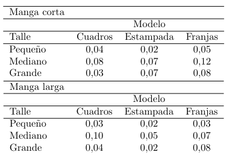

# Index
- [Index](#index)
- [Ejercicio 1](#ejercicio-1)
  - [a](#a)
  - [b](#b)
  - [c](#c)
  - [d](#d)
  - [e](#e)
- [Ejercicio 2](#ejercicio-2)
- [Ejercicio 3](#ejercicio-3)
  - [a](#a-1)
  - [b](#b-1)
  - [c](#c-1)
  - [d](#d-1)
  - [e](#e-1)
  - [f](#f)
- [Ejercicio 4](#ejercicio-4)
  - [a](#a-2)
  - [b](#b-2)
- [Ejercicio 5](#ejercicio-5)
  - [a](#a-3)
  - [b](#b-3)
- [Ejercicio 6](#ejercicio-6)
  - [a](#a-4)
  - [b](#b-4)
- [Ejercicio 7](#ejercicio-7)
  - [a](#a-5)
  - [b](#b-5)
  - [c](#c-2)
- [Ejercicio 8](#ejercicio-8)
  - [a](#a-6)
  - [b](#b-6)
  - [c](#c-3)
  - [d](#d-2)
  - [e](#e-2)
  - [f](#f-1)
- [Ejercicio 9](#ejercicio-9)
  - [a](#a-7)
  - [b](#b-7)
- [Ejercicio 10](#ejercicio-10)
  - [a](#a-8)
  - [b](#b-8)
  - [c](#c-4)
- [Ejercicio 11](#ejercicio-11)
  - [a](#a-9)
  - [b](#b-9)
  - [c](#c-5)
- [Ejercicio 12](#ejercicio-12)
- [Ejercicio 13](#ejercicio-13)
  - [a](#a-10)
  - [b](#b-10)
- [Ejercicio 14](#ejercicio-14)
- [Ejercicio 15](#ejercicio-15)
  - [a](#a-11)
  - [b](#b-11)
  - [c](#c-6)
  - [d](#d-3)
- [Ejercicio 16](#ejercicio-16)
  - [a](#a-12)
  - [b](#b-12)
  - [c](#c-7)
  - [d](#d-4)
- [Ejercicio 17](#ejercicio-17)
  - [a](#a-13)
  - [b](#b-13)
  - [c](#c-8)
- [Ejercicio 18](#ejercicio-18)
  - [a](#a-14)
  - [b](#b-14)
  - [c](#c-9)
  - [d](#d-5)

# Ejercicio 1
La biblioteca de una universidad tiene cinco ejemplares de un cierto texto en reserva. Dos ejemplares $\left(1\right.$ y $\left.2\right)$ son primeras impresiones y los otros tres $\left(3, 4\right.$ y $\left.5\right)$ son segundas impresiones. Un estudiante examina estos libros (sin repetir) en orden aleatorio, deteniéndose sólo cuando selecciona una segunda impresión.

## a
Hacer una lista de todos los resultados posibles.

| 1ro | 2do | 3ro |
|:---:|:---:|:---:|
| 3   | -   | -   |
| 4   | -   | -   |
| 5   | -   | -   |
| 1   | 3   | -   |
| 1   | 4   | -   |
| 1   | 5   | -   |
| 1   | 2   | 3   |
| 1   | 2   | 4   |
| 1   | 2   | 5   |
| 2   | 3   | -   |
| 2   | 4   | -   |
| 2   | 5   | -   |
| 2   | 1   | 3   |
| 2   | 1   | 4   |
| 2   | 1   | 5   |

## b
Sea el evento $A$: sólo un libro es examinado. ¿Cuáles resultados están en $A$?

> $A = \{\{3\}, \{4\}, \{5\}\}$

## c
Sea el evento $B$: el libro $5$ es seleccionado. ¿Cuáles resultados están en $B$?

> $B = \{\{5\}, \{1, 5\}, \{2, 5\}, \{1, 2, 5\}, \{2, 1, 5\}\}$

## d
Sea el evento $C$: el libro $1$ no se examina. ¿Cuáles resultados están en $C$?

> $C = \{\{3\}, \{4\}, \{5\}, \{2, 3\}, \{2, 4\}, \{2, 5\}\}$

## e
Expresar $A ∩ B, A ∪ B$ y $\overline {(B ∩ C)}$.

- $A ∩ B = \{\{5\}\}$
- $A ∪ B = \{\{3\}, \{4\}, \{5\}, \{1, 5\}, \{2, 5\}, \{1, 2, 5\}, \{2, 1, 5\}\}$
$$
\begin{gather*}
\overline {(B ∩ C)} &=& \overline {\{\{5\}, \{2, 5\}\}} \\
&=& \{\{3\}, \{4\}, \{1, 3\}, \{1, 4\}, \{1, 5\}, \{2, 3\}, \{2, 4\}, \{1, 2, 3\}, \{1, 2, 4\}, \{1, 2, 5\}, \{2, 1, 3\}, \{2, 1, 4\}, \{2, 1, 5\}\}
\end{gather*}
$$

# Ejercicio 2
Demostrar que si un evento $A$ está contenido en otro $B$, entonces 
$$
P(B − A) = P (B) − P (A) \text{ y } P (A) ≤ P (B).
$$

En general, dados dos eventos $A$ y $B$, ¿qué relación de orden existe entre $P(A), P(A ∩ B)$ y $P(A ∪ B)$?

$$
\begin{gather*}
  A \sub B &\Rightarrow& A \cap B &=& A \\
  & \Rightarrow & A \cup B &=& B \\
  & \Rightarrow & A \cup B &=& B \\
  \\
  && P(B - A) &=& P(B \backslash A) \\
  &&&=& P(B) - P(A \cap B) \\
  &&&=& P(B) - P(A) \\
\end{gather*}
$$

Sabemos que $0 \le P(C) \le 1$, entonces si tomamos $C = B - A$ tenemos

$$
\begin{gather*}
0 &\le& P(C) &\le& 1 \\
0 &\le& P(B - A) &\le& 1 \\
0 &\le& P(B) - P(A) &\le& 1 \\
P(A) &\le& P(B) &\le& 1 + P(A) \\
\end{gather*}
$$

Por ende, $A \sub B \Rightarrow P(A) \le P(B)$.

> La relación entre $P(A), P(A ∩ B)$ y $P(A ∪ B)$ es 
> $$
\begin{gather*}
P (A \cap B) \le P (A) \le P (A \cup B) \\
\end{gather*}
$$

# Ejercicio 3
Una empresa de consultoría de computadoras ha licitado en tres proyectos. Sea $A_i = \{\text{proyecto } i \text{ obtenido}\}$, para $i = 1, 2, 3$, y supongamos que $P(A_1) = 0.22, P(A_2) = 0.25$ y $P(A_3) = 0.28, P(A_1 ∩ A_2) = 0.11, P(A_1 ∩ A_3) = 0.05, P(A_2 ∩ A_3) = 0.07$ y $P(A_1 ∩ A_2 ∩ A_3) = 0.01$. Calcule la probabilidad de los siguientes eventos:

## a
> $A_1 ∪ A_2$

$$
\begin{gather*}
  P(A_1 ∪ A_2) &=& P(A_1) + P(A_2) - P(A_1 ∩ A_2) \\
  &=& 0.22 + 0.25 - 0.11 \\
  &=& 0.36
\end{gather*}
$$

## b
> $\overline A_1 ∩ \overline A_2$ (Sugerencia: $\overline {(A_1 ∪ A_2)} = \overline A_1 ∩ \overline A_2$)

$$
\begin{gather*}
  P(\overline A_1 ∩ \overline A_2) &=& \overline {(A_1 ∪ A_2)} \\
  &=& \overline {0.36} \\
  &=& 0.64
\end{gather*}
$$

## c
> $A_1 ∪ A_2 ∪ A_3$

$$
\begin{gather*}
  P(A_1 ∪ A_2 ∪ A_3) &=& \sum _{i=1}^n (-1)^{i+1} \left(\sum _{1 \le j_1 < \dots < j_i \le n} P(A_{j_1} \cap \dots \cap A_{j_i})\right) \\
  &=& (P(A_1) + P(A_2) + P(A_3)) - (P(A_1 \cap A_2) + P(A_1 \cap A_3) + P(A_2 \cap A_3)) + (P(A_1 \cap A_2 \cap A_3)) \\
  &=& P(A_1) + P(A_2) + P(A_3) - P(A_1 \cap A_2) - P(A_1 \cap A_3) - P(A_2 \cap A_3) + P(A_1 \cap A_2 \cap A_3) \\
  &=& 0.22 + 0.25 + 0.28 - 0.11 - 0.05 - 0.07 + 0.01 \\
  &=& 0.53 \\
\end{gather*}
$$

## d
> $\overline A_1 ∩ \overline A_2 ∩ \overline A_3$

$$
\begin{gather*}
  P(\overline A_1 ∩ \overline A_2 ∩ \overline A_3) &=& P(\overline {A_1 \cup A_2} ∩ \overline A_3) \\
  &=& P(\overline {A_1 \cup A_2 \cup A_3}) \\
  &=& \overline {0.53} \\
  &=& 0.47 \\
\end{gather*}
$$

## e
> $\overline A_1 ∩ \overline A_2 ∩ A_3$

$$
\begin{gather*}
  (\overline A_1 ∩ \overline A_2) \backslash (\overline A_1 ∩ \overline A_2 ∩ A_3) &=& (\overline A_1 ∩ \overline A_2 ∩ \overline A_3) \\
  (\overline A_1 ∩ \overline A_2) &\sub & (\overline A_1 ∩ \overline A_2 ∩ \overline A_3) \\
  \\
  P(\overline A_1 ∩ \overline A_2) &=& P(\overline A_1 ∩ \overline A_2 ∩ A_3) + P((\overline A_1 ∩ \overline A_2) \backslash (\overline A_1 ∩ \overline A_2 ∩ A_3)) \\
  0.64 &=& P(\overline A_1 ∩ \overline A_2 ∩ A_3) + P(\overline A_1 ∩ \overline A_2 ∩ \overline A_3) \\
  &=& P(\overline A_1 ∩ \overline A_2 ∩ A_3) + 0.47 \\
  0.17 &=& P(\overline A_1 ∩ \overline A_2 ∩ A_3) \\
\end{gather*}
$$

## f
> $(\overline A_1 ∩ \overline A_2) ∪ A_3$

$$
\begin{gather*}
  P((\overline A_1 ∩ \overline A_2) ∪ A_3) &=& P(\overline A_1 ∩ \overline A_2) + P(A_3) - P((\overline A_1 ∩ \overline A_2) \cap A_3) \\
  &=& 0.64 + 0.28 - P(\overline A_1 ∩ \overline A_2 \cap A_3) \\
  &=& 0.92 - 0.17 \\
  &=& 0.75 \\
\end{gather*}
$$

# Ejercicio 4
Cinco empresas $F_1, F_2, ..., F_5$ hacen propuestas con respecto a tres contratos separados, $C_1, C_2$ y $C_3$. Todos los contratos son asignados. Cada empresa sólo puede obtener a lo sumo un contrato. Los contratos son diferentes, de tal forma que la asignación de $C_1$ a $F_1$ se debe diferenciar de la asignación de $C_2$ a $F_1$.

## a
¿Cuántos puntos muestrales hay en total en este experimento que trata de la asignación de los contratos a las empresas? (No hay necesidad de listar todos los puntos).

- Posibilidades para el $1er$ contrato (independientemente de cúal sea): $5$,
- Posibilidades para el $2do$ contrato: $4$,
- Posibilidades para el $3er$ contrato: $3$,
- Total de muestras: $5*4*3 = 60$

## b
Encuentre la probabilidad de que se conceda un contrato a la empresa $F_3$, bajo el supuesto de que los puntos muestrales son equiprobables.

- Posibilidades para el $1er$ contrato (independientemente de cúal sea): $1 * 4 * 3$,
- Posibilidades para el $2do$ contrato: $4 * 1 * 3$,
- Posibilidades para el $3er$ contrato: $4 * 3 * 1$,
- Total de posibilidades: $12 + 12 + 12 = 36$

Probabilidad de que $F_3$ consiga un contrato $\frac {36} {60} = \frac 6 {10} = 0.6$

# Ejercicio 5
Al poco tiempo de ser puestos en servicios, algunos colectivos fabricados por cierta compañía presentan grietas en su parte inferior. Una ciudad tiene 25 de estos colectivos y han aparecido grietas en $8$ de ellos. Se seleccionan aleatoriamente $5$ colectivos para hacer una inspección.

## a
¿Cuál es la probabilidad de que exactamente $4$ de los $5$ colectivos tengan grietas?

- Calculamos primero el número de muestras con el número combinatorio de $25$ ejemplares y $5$ tomas: $\binom{25} 5 = 53130$.
- Elegimos 4 de los agrietados y uno del resto: $\binom 8 4 \binom{17} 1 = 70 * 17 = 1190$.
- Calculamos la probabilidad de que suceda $\frac {1190} {53130} = 0.02239$

## b
¿Cuál es la probabilidad de que al menos $4$ de los seleccionados tengan grietas?

- Al caso anterior, le sumamos los casos en los que todos están agrietados: $\binom 8 4 \binom{17} 1 + \binom 8 5 = 1190 + 56 = 1246$.
- Calculamos la probabilidad de que suceda $\frac {1246} {53130} = 0.02345$

# Ejercicio 6
Una profesora desea programar una reunión con cada uno de sus ocho ayudantes, cuatro hombres y cuatro mujeres, para analizar su curso. Se supone que todos los ordenamientos posibles de las reuniones tienen la misma probabilidad de ser elegidos.

## a
¿Cuál es la probabilidad de que por lo menos una asistente (mujer) esté entre los tres primeros con quien se reúne la profesora?

Calculamos primero las muestras
$$
\frac {8!} {(8 - 3)!} = \frac {8!} {5!} = 8 * 7 * 6 = 336
$$

- Posibilidades para el $1er$ llamado: $4 * 7 * 6 = 168$,
- Posibilidades para el $2do$ llamado: $4 * 4 * 6 = 96$,
- Posibilidades para el $3er$ llamado: $4 * 3 * 4 = 48$,
- Total de posibilidades: $168 + 96 + 48 = 312$
- Probabilidad: $\frac {312} {336} = 0.93$

## b
¿Cuál es la probabilidad de que después de las cinco primeras reuniones, la profesora se haya reunido con todas las asistentes?

Calculamos primero las muestras
$$
\frac {8!} {(8 - 5)!} = \frac {8!} {3!} = 8 * 7 * 6 * 5 * 4 = 6720
$$

- Posibilidades para un llamado llamado: $4 * 3 * 2 * 1 * 4 = 96$,
  - Resulta que todos tienen la misma estructura, solo cambia la posición en la que iría uno de los $4$ hombres y son $5$ llamados en total.
- Total de posibilidades: $96 * 5 = 480$
- Probabilidad: $\frac {480} {6720} = 0.071$

# Ejercicio 7
Un departamento académico con cinco miembros de la facultad: Anderson, Box, Cox, Cramer y Fisher, debe seleccionar a dos de sus miembros para prestar servicio en una comisión de revisión de personal. Debido a que el trabajo será lento, nadie desea prestar ese servicio, así que deciden que el representante será seleccionado por el método de colocar cinco boletas de papel en una caja, mezclarlas y seleccionar dos.

## a
¿Cuál es la probabilidad de que Anderson y Box sean seleccionados?

- No importa el órden, $5$ elementos y $2$ tomas: $\binom 5 2 = 10$.
- Solo una posibilidad, entonces la probabilidad es: $\frac 1 {10} = 0.1$.

## b
¿Cuál es la probabilidad de que se seleccione por lo menos a uno de los dos miembros cuyos apellidos comienzan con C?

- Elegimos cualquiera de $C$, y cualquiera de los restantes, y consideramos también el caso $(C, C)$. Posibilidades: $\binom 2 1 \binom 3 1 + \binom 2 2 = 2 * 3 + 1 = 7$.
- Probabilidad: $\frac 7 {10} = 0.7$

## c
Si los cinco miembros de la facultad han dado clase en la universidad durante $3, 6, 7, 10$ y $14$ años respectivamente, ¿cuál es la probabilidad de que entre los dos representantes seleccionados tengan por lo menos 15 años de experiencia en la enseñanza?

- Fisher suma $15$ con cualquier otro: $+4$,
- Cramer sólo con Fisher, Box y Cox: $+2$,
- Cox y Box sólo con Fisher y Cramer,
- Anderson sólo con Fisher.
- Posibilidades: $4 + 2 = 6$
- Probabilidad: $\frac 6 {10} = 0.6$

# Ejercicio 8
Una gran tienda de departamentos vende camisas deportivas en tres talles (pequeño, mediano y grande), en tres modelos (a cuadros, estampados y de franjas) y con dos largos de mangas (corta y larga). Las siguientes tablas presentan las proporciones de camisas vendidas que caben en varias combinaciones de categorías.

  

## a
¿Cuál es la probabilidad de que la camisa que se venda sea mediana, de manga larga y estampada?

> $0.05$

## b
¿Cuál es la probabilidad de que la camisa que se venda sea mediana y estampada?

$$
\begin{gather*}
P(A_{MedEest}) &=& P(A_{LarMedEest}) \cup P(A_{CorMedEest}) \\
&=& P(A_{LarMedEest}) + P(A_{CorMedEest}) - P(A_{LarMedEest} \cap A_{CorMedEest}) \\
&=& P(A_{LarMedEest}) + P(A_{CorMedEest}) \\
&=& 0.05 + 0.07 \\
&=& 0.12 \\
\end{gather*}
$$
> Como $A_{LarMedEest}, A_{CorMedEest}$ son disjuntos, $P(A_{LarMedEest} \cap A_{CorMedEest}) = P(\emptyset) = 0$

## c
¿Cuál es la probabilidad de que la camisa que se venda sea de manga corta? ¿Y de manga larga?

$$
\begin{gather*}
P(A_{Cor}) &=& P\left(\bigcup_{i=Peq} ^{Gra} \bigcup_{j=Cua} ^{Fra} A_{Corij} \right) \\
&=& 0.04 + 0.02 + 0.05 + 0.08 +0.07 + 0.12 + 0.03 + 0.07 + 0.08 \\
&=& 0.56 \\
\end{gather*}
$$

> Como todos los $A_{Corij}$ son disjuntos la probabilidad de su unión es igual a la suma de sus partes.

Y podríamos calcular $P(A_{Lar})$, pero es má fácil ver que $P(\overline A_{Cor}) = P(A_{Lar})$, entonces $P(A_{Lar}) = 0.44$.

## d
¿Cuál es la probabilidad de que el talle de la camisa que se venda sea mediano? ¿Y que el modelo sea estampado?

$$
\begin{gather*}
P(A_{Med}) &=& P\left(\bigcup _{i=Cor} ^{Lar} \bigcup_{j=Cua} ^{Fra} A_{iMedj} \right) \\
&=& (0.08 + 0.07 + 0.12) + (0.10 + 0.05 + 0.07) \\
&=& 0.49 \\
\\
P(A_{Est}) &=& P\left(\bigcup _{i=Cor} ^{Lar} \bigcup_{j=Peq} ^{Gra} A_{ijEst} \right) \\
&=& (0.02 + 0.07 + 0.07) + (0.02 + 0.05 + 0.02) \\
&=& 0.25 \\
\end{gather*}
$$

## e
Dado que la camisa que se vendió era a cuadros y de manga corta, ¿cuál es la probabilidad de que su talle sea mediano?

$$
\begin{gather*}
P(A_{Med} | A_{CorCua}) &=& \frac {P(A_{Med} \cap A_{CorCua})} {P(A_{CorCua})} \\
&=& \frac {0.08} {0.04 + 0.08 + 0.03} \\
&=& \frac {0.08} {0.15} \\
&=& 0.53 \\
\end{gather*}
$$

## f
Dado que la camisa que se vendió era a cuadros y mediana, ¿cuál es la probabilidad de que sea de manga corta? ¿Y de manga larga?

$$
\begin{gather*}
P(A_{Cor} | A_{MedCua}) &=& \frac {P(A_{Cor} \cap A_{MedCua})} {P(A_{MedCua})} \\
&=& \frac {0.08} {0.08 + 0.10} \\
&=& \frac {0.08} {0.18} \\
&=& 0.44 \\
\\
P(A_{Lar} | A_{MedCua}) &=& \frac {P(A_{Lar} \cap A_{MedCua})} {P(A_{MedCua})} \\
&=& \frac {0.10} {0.18} \\
&=& 0.55 \\
\end{gather*}
$$

# Ejercicio 9
Una caja contiene $6$ cubos rojos y $4$ verdes y una segunda caja contiene $7$ cubos rojos y $3$ verdes. Se elige al azar un cubo de la primera caja y se pone en la segunda caja. Luego se selecciona al azar un cubo de la segunda caja y se pone en la primera caja.

## a
¿Cuál es la probabilidad de que se seleccione un cubo rojo de la primera caja y un cubo rojo de la segunda caja?

- Para la $1er$ caja hay $10$ cubos y solo $6$ son rojos. Entonces hay una probabilidad de sacar un cubo rojo de $0.6$.
- Para la $2da$ caja dependemos de la $1ra$:

$$
\begin{gather*}
P(S_R | F_R) &=& \frac {P(S_R \cap F_R)} {P(F_R)} \\
\frac 8 {11} &=& \frac {P(S_R \cap F_R)} {0.6} \\
\frac 8 {11} * \frac 6 {10} &=& P(S_R \cap F_R) \\
\frac {24} {55} &=& P(S_R \cap F_R) \\
\end{gather*}
$$
- La probabilidad es de $0.4364$.

## b
Al finalizar el proceso de selección ¿cuál es la probabilidad de que los números de cubos rojos y verdes de la primera caja sean idénticos a los que habían al comienzo?

- Si sacamos una roja, tenemos que devolver una roja, y es análogo para una verde.
- Calculamos el caso anterior pero para una verde

$$
\begin{gather*}
P(S_V | F_V) &=& \frac {P(S_V \cap F_V)} {P(F_V)} \\
\frac 4 {11} &=& \frac {P(S_V \cap F_V)} {P(\overline F_V)} \\
&=& \frac {P(S_V \cap F_V)} {0.4} \\
\frac 4 {11} * \frac 4 {10} &=& P(S_V \cap F_V) \\
\frac 8 {55} &=& P(S_V \cap F_V) \\
\end{gather*}
$$

- Y la probabilidad de unión de ambos casos es la probabilidad que buscamos

$$
\begin{gather*}
P((S_R \cap F_R) \cup (S_V \cap F_V)) &=& P(S_R \cap F_R) + P(S_V \cap F_V) - P(S_R \cap F_R \cap S_V \cap F_V) \\
&=& \frac {24} {55} + \frac 8 {55} - P((S_R \cap S_V) \cap (F_R \cap F_V)) \\
&=& \frac {32} {55} - P(\empty \cap \empty) \\
&=& 0.5818 \\
\end{gather*}
$$

# Ejercicio 10
## a
Dados los eventos $A$ y $B$ con $P(B) > 0$, demuestre que $P(A|B) + P(\overline A|B) = 1$

$$
\begin{gather*}
P(A|B) &=& \frac {P(A \cap B)} {P(B)} \\
\\
P(\overline A|B) &=& \frac {P(\overline A \cap B)} {P(B)} \\
\\
P(A|B) + P(\overline A|B) &=& \frac {P(A \cap B)} {P(B)} + \frac {P(\overline A \cap B)} {P(B)} \\
&=& \frac {P(A \cap B) + P(\overline A \cap B)} {P(B)} \\
&=& \frac {P((A \cap B) \cup (\overline A \cap B)) + P((A \cap B) \cap (\overline A \cap B))} {P(B)} \\
&=& \frac {P((A \cup \overline A) \cap B) + P((A \cap \overline A) \cap (B \cap B))} {P(B)} \\
&=& \frac {P(\Omega \cap B) + P(\emptyset \cap B)} {P(B)} \\
&=& \frac {P(B) + P(\emptyset)} {P(B)} \\
&=& \frac {P(B)} {P(B)} \\
&=& 1 \\
\end{gather*}
$$

## b
Si $P(B|A) > P(B)$ demuestre que $P(\overline B|A) < P(\overline B)$

$$
\begin{gather*}
P(B|A) &>& P(B) \\
1 - P(\overline B|A) &>& P(B) \\
1 &>& P(B) + P(\overline B|A) \\
1 - P(B) &>& P(\overline B|A) \\
P(\overline B) &>& P(\overline B|A) \\
P(\overline B|A) &<& P(\overline B) \\
\end{gather*}
$$

## c
Dados los eventos $A, B$ y $C$ con $P(C) > 0$, demuestre que $P(A ∪ B|C) = P(A|C) + P(B|C) − P(A ∩ B|C)$

$$
\begin{gather*}
P(A ∪ B|C) &=& \frac {P((A ∪ B) \cap C)} {P(C)} \\
&=& \frac {P((A \cap C) ∪ (B \cap C))} {P(C)} \\
&=& \frac {P(A \cap C) + P(B \cap C) - P(A \cap C \cap B \cap C)} {P(C)} \\
&=& \frac {P(A \cap C)} {P(C)} + \frac {P(B \cap C)} {P(C)} - \frac {P((A \cap B) \cap C)} {P(C)} \\
&=& P(A|C) + P(B|C) - P(A \cap B|C) \\
\end{gather*}
$$

# Ejercicio 11
Uno de cada $25$ adultos está afectado de cierta enfermedad para la que se ha desarrollado una prueba de diagnóstico. La prueba es tal que, cuando un individuo padece la enfermedad, el resultado de la prueba es positivo en un $99\%$ de las veces, mientras que un individuo sin la enfermedad mostrará un resultado positivo sólo el $2\%$ de las veces.

> El $4\%$ está contagiado y el $96\%$ está sano.

## a
¿Cuál es la probabilidad de que un resultado de la prueba sea positivo?

- Calculamos la probabilidad de que un contagiado de positivo y de que un sano de positivo:
$$
\begin{gather*}
P(R_+ | A_c) &=& \frac {P(R_+ \cap A_c)} {P(A_c)} \\
0.99 &=& \frac {P(R_+ \cap A_c)} {0.04} \\
0.99 * 0.04 &=& P(R_+ \cap A_c) \\
0.0396 &=& P(R_+ \cap A_c) \\
\\
P(R_+ | A_s) &=& \frac {P(R_+ \cap A_s)} {P(A_s)} \\
0.02 &=& \frac {P(R_+ \cap A_s)} {0.96} \\
0.02 * 0.96 &=& P(R_+ \cap A_s) \\
0.0192 &=& P(R_+ \cap A_s) \\
\end{gather*}
$$
- Calculamos la probabilidad de $P_+$
$$
\begin{gather*}
P(R_+) &=& P(R_+ \cap \Omega) \\
&=& P(R_+ \cap (A_c \cup A_s)) \\
&=& P((R_+ \cap A_c) \cup (R_+ \cap A_s)) \\
&=& P(R_+ \cap A_c) + P(R_+ \cap A_s) - P((R_+ \cap A_c) \cap (R_+ \cap A_s)) \\
&=& 0.0396 + 0.0192 - P((R_+ \cap R_+) \cap (A_c \cap A_s)) \\
&=& 0.0588 - P(R_+ \cap \emptyset) \\
&=& 0.0588 - P(\emptyset) \\
&=& 0.0588 \\
\end{gather*}
$$

## b
Dado que el resultado de la prueba es positivo, ¿cuál es la probabilidad de que el individuo tenga la enfermedad?

$$
\begin{gather*}
P(A_c|R_+) &=& \frac {P(A_c \cap R_+)} {P(R_+)} \\
&=& \frac {0.0396} {0.0588} \\
&=& 0.673 \\
\end{gather*}
$$

## c
Dado que el resultado de la prueba es negativo, ¿cuál es la probabilidad de que el individuo no tenga la enfermedad?

$$
\begin{gather*}
P(A_s|R_-) &=& \frac {P(A_s \cap R_-)} {P(R_-)} \\
&=& \frac {P(A_s \cap \overline R_+)} {P(\overline R_+)} \\
&=& \frac {P(\overline {\overline A_s \cup R_+})} {\overline {0.0588}} \\
&=& \frac {P(\overline {A_c \cup R_+})} {0.9412} \\
&=& \frac {1 - (P({A_c}) + P(R_+) - P(A_c \cap R_+))} {0.9412} \\
&=& \frac {1 - (0.04 + 0.0588 - 0.0396)} {0.9412} \\
&=& \frac {1 - 0.0592} {0.9412} \\
&=& \frac {0.9408} {0.9412} \\
&=& 0.9996 \\
\end{gather*}
$$

# Ejercicio 12
Sean $A$ y $B$ eventos independientes, demostrar que $\overline A$ y $B$, $A$ y $\overline B$ y $\overline A$ y $\overline B$ son independientes.

$$
\begin{gather*}
P(A \cap B) &=& P(A) * P(B) \\
\\
B &=& B \cap \Omega \\
&=& B \cap (A \cup \overline A) \\
&=& (B \cap A) \cup (B \cap \overline A) \\
\\
P(B) &=& P((B \cap A) \cup (B \cap \overline A)) \\
&=& P(B \cap A) + P(B \cap \overline A) - P((B \cap A) \cap (B \cap \overline A)) \\
&=& P(B)P(A) + P(B \cap \overline A) - P(B \cap \emptyset) \\
P(B) -  P(B)P(A) &=& P(B \cap \overline A) - P(\emptyset) \\
P(B) (1 - P(A)) &=& P(B \cap \overline A) \\
P(B)P(\overline A) &=& P(B \cap \overline A) \\
\end{gather*}
$$

- Análogamente tenemos

$$
\begin{gather*}
A &=& (A \cap B) \cup (A \cap \overline B) \\
\\
P(A) &=& P(A)P(B) + P(A \cap \overline B) \\
P(A) -  P(A)P(B) &=& P(A \cap \overline B) \\
P(A)P(\overline B) &=& P(A \cap \overline B) \\
\end{gather*}
$$

- Y finalmente

$$
\begin{gather*}
A \cup B &=& (A \cap B) \cup (A \cap \overline B) \\
\\
P(\overline A \cap \overline B) &=& P(\overline {A \cup B}) \\
&=& 1 - P(A \cup B) \\
&=& 1 - (P(A) + P(B) - P(A \cap B)) \\
&=& 1 - (P(A) + P(B) - P(A)P(B)) \\
&=& 1 - (P(A)(1 - P(B)) + P(B)) \\
&=& 1 - P(A)P(\overline B) - P(B) \\
&=& - P(A)P(\overline B) + P(\overline B) \\
&=& (-P(A) + 1)P(\overline B) \\
&=& P(\overline A)P(\overline B) \\
\end{gather*}
$$

# Ejercicio 13
Una costura hecha en un avión necesita $25$ remaches. La costura tendrá que volver a realizarse si al menos uno de los remaches está defectuoso. Suponga que los remaches están defectuosos independientemente, unos de otros, cada uno con la misma probabilidad $p$. 

## a
Si el $14\%$ de todas las costuras necesitan volver a efectuarse, ¿cuál es la probabilidad $p$ de que un remache esté defectuoso?

- Consideramos a $q = \overline p$ como la probabilidad de que el remache esté en condiciones, y a $\bigcap _{i=1} ^{25} R_i$ como los casos en los que las costuras están en condiciones:

$$
\begin{gather*}
P\left(\bigcap _{i=1} ^{25} R_i \right) &=& P(R_1) * \dots * P(R_{25}) \\
\overline {0.14} &=& q * \dots * q \\
0.86 &=& q^{25} \\
\sqrt[25]{0.86} &=& q \\
0.994 &=& q \\
\\
0.006 &=& p
\end{gather*}
$$

## b
Si se quiere que sólo el $10\%$ de las costuras necesiten volver a ejecutarse, ¿cuál debería ser la probabilidad $p$ de que un remache esté defectuoso?

- Análogo al anterior

$$
\begin{gather*}
P\left(\bigcap _{i=1} ^{25} R_i \right) &=& P(R_1) * \dots * P(R_{25}) \\
\overline {0.1} &=& q * \dots * q \\
0.9 &=& q^{25} \\
\sqrt[25]{0.9} &=& q \\
.9957 &=& q \\
\\
0.0043 &=& p
\end{gather*}
$$

# Ejercicio 14
En un lote de $10$ tablas de madera, dos están demasiado verdes para ser usadas en construcción de primera calidad.
Se seleccionan $2$ tablas al azar, una después de otra.
Sea $A = \{\text{la primera tabla está verde}\}$ y $B = \{\text{la segunda tabla está verde}\}$. Calcule $P(A), P(B)$ y $P(A ∩ B)$.
¿Son $A$ y $B$ independientes?

- Es claro que no son independientes, porque no se sacan en simultaneo, sino en serie.

$$
P(A) = \frac 2 {10} = 0.2
$$

- Para $P(B)$ necesitamos calcular el caso en el que la primer tabla está verde y en el que no

$$
\begin{gather*}
P(B|A) &=& \frac {P(B \cap A)} {P(A)} \\
\frac 1 9 &=& \frac {P(B \cap A)} {0.2} \\
\frac 1 9 * 0.2 &=& P(B \cap A) \\
0.022 &=& P(B \cap A) \\
\\
P(B|\overline A) &=& \frac {P(B \cap \overline A)} {P(\overline A)} \\
\frac 2 9 &=& \frac {P(B \cap \overline A)} {0.8} \\
\frac 2 9 * 0.8 &=& P(B \cap \overline A) \\
0.178 &=& P(B \cap \overline A) \\
\end{gather*}
$$

- Entonces tenemos ya $P(A \cap B)$ y nos falta solo $P(B)$

$$
\begin{gather*}
P(B) &=& P((B \cap A) \cup (B \cap \overline A)) \\
&=& P(B \cap A) + P(B \cap \overline A) \\
&=& 0.022 + 0.178 \\
&=& 0.2 \\
\end{gather*}
$$

# Ejercicio 15
En una carrera de caballos participan $6$ caballos numerados del $1$ al $6$. Todos los resultados posibles de la carrera son igualmente probables. Hacen podio los tres primeros caballos en terminar la carrera.

## a
¿Cuál es la probabilidad de que el caballo con el número $2$ salga en primer lugar?

- Es una permutación de 6 elementos y 3 tomas

$$
\frac {6!} {(6 - 3)!} = 6*5*4 = 120
$$

- Por otro lado, que $2$ salga en primer lugar es una permutación de 5 elementos y 2 tomas

$$
\frac {5!} {(5 - 2)!} = 5*4 = 20
$$

- La probabilidad de que $2$ salga primero es $\frac{20}{120} = \frac 1 6$

## b
¿Cuál es la probabilidad de que el caballo con el número $1$ haga podio?

- La cantidad de muestras es una combinación de $6$ elementos y $3$ tomas:

$$
\binom 6 3 = \frac {6!} {3! * 3!} = 5*4 = 20
$$

- Nuestro caso es una combinación de $5$ elementos y $2$ tomas, ya que un elemento ya está fijo:

$$
\binom 5 2 = \frac {5!} {2! * 3!} = 5*2 = 10
$$

- Y la probabilidad de $1$ en podio es

$$
\frac {10} {20} = 0.5
$$

## c
¿Cuál es la probabilidad de que ocurra al menos uno de los dos ítems anteriores?

- Nuestro caso es la unión de los ejercicios $a$ y $b$. Calculamos la intersección de $a$ y $b$, donde $2$ es primero y $1$ es segundo o tercero:
  - $2$ tiene posición fija, $1$ solo tiene dos posibles posiciones, al igual que los otros 4 caballos: $1 * 1 * 4 + 1 * 4 * 1 = 4 + 4 = 8$

$$
\begin{gather*}
P(A \cup B) &=& P(A) + P(B) - P(A \cap B) \\
&=& \frac 1 6 + \frac 1 2 - \frac 8 {120} \\
&=& \frac {1 + 3} 6 - \frac 2 {30} \\
&=& \frac {4*5} {30} - \frac 2 {30} \\
&=& \frac {20 - 2} {30} \\
&=& \frac {18} {30} \\
&=& 0.6 \\
\end{gather*}
$$

## d
Una persona hace apuestas sobre el resultado de la carrera. Apuesta que los caballos numerados con $1, 2$ y $3$ hacen podio. ¿Cuál es la probabilidad de que esta persona gane su apuesta?

- Solo existe una combinación con $1, 2$ y $3$, y existen $20$ combinaciones posibles para $6$ elementos y $3$ tomas, entonces la probabilidad de ganar la apuesta es de $\frac 1 20 = 0.05$

# Ejercicio 16
Un mazo de $52$ cartas es mezclado y se reparten $13$ cartas a cada uno de los $4$ jugadores $A, B, C$ y $D$. Calcular la probabilidad de los siguientes eventos:

## a
$A$ tiene todos los corazones, $B$ todos los diamantes, $C$ todos los tréboles y $D$ todas las picas.

- Las posibles permutaciones para $52$ cartas son $52!$
- Para cada uno de los eventos, existen $13!$ permutaciones.
  - Entonces nuestros casos favorables son $(13!)^4$.

$$
\frac {(13!)^4} {52!} = 1.8641157 * 10^{-29}
$$

> También se puede probar con la regla de la multiplicación:
> $$
\begin{gather*}
P(A \cap B \cap C \cap D) &=& P(A)P(B|A)P(C|(A \cap B))P(D|(A \cap B) \cap C) \\
&=& \frac 1 {\binom {52} {13}} * \frac 1 {\binom {39} {13}} * \frac 1 {\binom {26} {13}} * \frac 1 {\binom {13} {13}} \\
&=& \frac 1 {635.013.559.600} * \frac 1 {8.122.425.443} * \frac 1 {10.400.600} \\
&=& 1.8641157 * 10^{-29}
\end{gather*}
$$
> La cual, si se aplica álgebra sobre los coeficientes binomiales, se reduce a la expresión $\frac {(13!)^4} {52!}$.

## b
Cada jugador tiene cartas de un solo palo.

- Para la primera permutación tenemos $52 * 12!$, para la segunda $39 * 12!$, para la tercera $26 * 12!$ y para la cuarta $13!$.

$$
\begin{gather*}
\frac {52 * 12! * 39 * 12! * 26 * 12! * 13 * 12!} {52!} &=& \frac {52 * 39 * 26 * 13 *(12!)^4} {52!} \\
&=& \frac {4 * 3 * 2 * 1 * 13^4 * (12!)^4} {52!} \\
&=& \frac {24 * (13!)^4} {52!} \\
&=& 24 * 1.8641157 * 10^{-29} \\
&=& 4.4738778 * 10^{-28}
\end{gather*}
$$

> $$
\begin{gather*}
P(A \cap B \cap C \cap D) &=& P(A)P(B|A)P(C|(A \cap B))P(D|(A \cap B) \cap C) \\
&=& \frac 4 {\binom {52} {13}} * \frac 3 {\binom {39} {13}} * \frac 2 {\binom {26} {13}} * \frac 1 {\binom {13} {13}} \\
&=& \frac 4 {635.013.559.600} * \frac 3 {8.122.425.443} * \frac 2 {10.400.600} \\
&=& 24 * 1.8641157 * 10^{-29} \\
&=& 4.4738778 * 10^{-28}
\end{gather*}
$$

## c
El jugador A no tiene ases.

- Las posibilidades son una combinación de $52$ cartas y $13$ tomas; y los casos favorables de $48$ cartas y $13$ tomas

$$
\begin{gather*}
\frac {\binom {48} {13}} {\binom {52} {13}} &=& \frac {\frac {48!} {13! * 35!}} {\frac {52!} {13! * 40!}} \\
&=& \frac {48!} {13! * 35!} * \frac {13! * 39!} {52!} \\
&=& \frac {39 * 38 * 37 * 36} {52 * 52 * 51 * 50 * 49} \\
&\approxeq& 0.30381752701
\end{gather*}
$$

## d
Cada jugador recibe un as.

$$
\begin{gather*}
P(A \cap B \cap C \cap D) &=& P(A)P(B|A)P(C|(A \cap B))P(D|(A \cap B) \cap C) \\
&=& \frac {4 * \binom {48} {12}} {\binom {52} {13}} * \frac {3 * \binom {36} {12}} {\binom {39} {13}} * \frac {2 * \binom {24} {12}} {\binom {26} {13}} * \frac {1 * \binom {12} {12}} {\binom {13} {13}} \\
&=& 24 * \frac {\binom {48} {12}} {\binom {52} {13}} * \frac {\binom {36} {12}} {\binom {39} {13}} * \frac {\binom {24} {12}} {\binom {26} {13}} * \frac {1 * 1} 1 \\
&=& 24 * \frac {\frac{48!}{12! 36!}} {\frac{52!}{13! 39!}} * \frac {\frac{36!}{12! 24!}} {\frac{39!}{26! 13!}} * \frac {\frac{24!}{12! 12!}} {\frac{26!}{13! 13!}} \\
&=& 24 * \frac{48!}{12! 36!} * \frac{13! 39!}{52!} * \frac{36!}{12! 24!} * \frac{26! 13!}{39!} * \frac{24!}{12! 12!} * \frac{13! 13!}{26!} \\
&=& 24 * \frac{48!}{12!} * \frac{13!}{52!} * \frac 1 {12!} * 13! * \frac 1 {12! 12!} * 13! 13! \\
&=& 24 * \frac 1 {12!^4} * \frac{13!^4}{52 * 51 * 50 * 49} \\
&=& 24 * \frac{13^4}{52 * 51 * 50 * 49} \\
&=& \frac{13^3}{17 * 25 * 49} \\
&=& 0.1055
\end{gather*}
$$

# Ejercicio 17
Se realizó una investigación en personas que sufren leucoplasia oral. El $85\%$ de ellas fuma o consume alcohol, el $45\%$ consume alcohol y el $60\%$ fuma.

- Nos falta el dato de los que fuman y toman:

$$
\begin{gather*}
P(A \cap F) &=& P(A) + P(F) - P(A \cap F) \\
&=& 0.45 + 0.6 - 0.85 \\
&=& 0.2 \\
\end{gather*}
$$

## a
¿Cuál es la probabilidad de que una persona elegida al azar de esta población consuma alcohol y no fume?

$$
\begin{gather*}
P(A) &=& P(A \cap \Omega) \\
0.45 &=& P(A \cap (F \cup \overline F)) \\
&=& P((A \cap F) \cup (A \cap \overline F)) \\
&=& P(A \cap F) + P(A \cap \overline F) - P((A \cap F) \cap (A \cap \overline F)) \\
&=& 0.2 + P(A \cap \overline F) - P(A \cap \emptyset) \\
0.25 &=& P(A \cap \overline F) - P(\emptyset) \\
0.25 &=& P(A \cap \overline F) \\
\end{gather*}
$$

## b
Si se elige al azar un individuo fumador, ¿cuál es la probabilidad de que consuma alcohol?

$$
\begin{gather*}
P(A|F) &=& \frac {P(A \cap F)} {P(F)} \\
&=& \frac {0.2} {0.6} \\
&=& 0.33 \\
\end{gather*}
$$

## c
¿Son independientes los eventos fumar y consumir alcohol?

- No, ya que $P(A \cap F) = 0.2 \ne 0.27 = P(A) * P(F)$.

# Ejercicio 18
Una compañía realiza el $50\%$ de sus envíos a través de la empresa de correos $1$, el $40\%$ a través de la empresa $2$ y el resto por la empresa $3$. De los paquetes enviados por la empresa $1$, el $2\%$ llega tarde a su destino. El $1\%$ de los paquetes enviados por la empresa de correos $2$ llega tarde y, de aquellos enviados por la empresa $3$, el $5\%$ llega tarde.

## a
¿Cuál es la probabilidad de que un paquete elegido al azar llegue tarde a su destino?

- Calculamos primero las probabilidades de si que sea enviado con una empresa y llegue tarde

$$
\begin{gather*}
P(T|E_1) &=& \frac {P(T \cap E_1)} {P(E_1)} \\
0.02 &=& \frac {P(T \cap E_1)} {0.5} \\
0.02 * 0.5 &=& P(T \cap E_1) \\
0.01 &=& P(T \cap E_1) \\
\\
P(T|E_2) &=& \frac {P(T \cap E_2)} {P(E_2)} \\
0.01 &=& \frac {P(T \cap E_2)} {0.4} \\
0.01 * 0.4 &=& P(T \cap E_2) \\
0.004 &=& P(T \cap E_2) \\
\\
P(T|E_3) &=& \frac {P(T \cap E_3)} {P(E_3)} \\
0.05 &=& \frac {P(T \cap E_3)} {0.1} \\
0.05 * 0.1 &=& P(T \cap E_3) \\
0.005 &=& P(T \cap E_3) \\
\end{gather*}
$$

- Calculamos ahora la probabilidad de que llegue tarde (sabiendo que los eventos $E_i$ son exluyentes para $1 \le i \le 3$): 

$$
\begin{gather*}
P(T) &=& P(T \cap (E_1 \cup E_2 \cup E_3)) \\
&=& P(T \cap E_1) + P(T \cap E_2) + P(T \cap E_3) \\
&=& 0.01 + 0.004 + 0.005 \\
&=& 0.019 \\
\end{gather*}
$$

## b
Si un paquete elegido al azar llega a tiempo, ¿cuál es la probabilidad de que haya sido enviado por la empresa $1$?

$$
\begin{gather*}
P(E_1) &=& P((E_1 \cap T) \cup (E_1 \cap \overline T)) \\
0.5 &=& P(E_1 \cap T) + P(E_1 \cap \overline T) \\
0.5 &=& 0.01 + P(E_1 \cap \overline T) \\
0.49 &=& P(E_1 \cap \overline T) \\
\end{gather*}
$$

## c
Si se sabe que el paquete no fue enviado por la empresa $3$, ¿cuál es la probabilidad de que llegue a tiempo a su destino?

$$
\begin{gather*}
P(T|\overline E_3) &=& \frac {P(T \cap \overline E_3)} {P(\overline E_3)} \\
&=& \frac {P(T \cap \overline E_3)} {\overline {0.1}} \\
&=& \frac {P(T \cap \overline E_3)} {0.9} \\
&=& \frac {P(T \cap (E_1 \cup E_2))} {0.9} \\
&=& \frac {P(T \cap E_1) + P(T \cap E_2)} {0.9} \\
&=& \frac {0.01 + 0.004} {0.9} \\
&=& \frac {0.014} {0.9} \\
&=& 0.0156
\end{gather*}
$$

## d
Si se eligen $10$ paquetes al azar de los enviados por esta compañía, ¿cuál es la probabilidad de que ninguno llegue tarde?

- Definimos a $T_i$ como la probabilidad de que el paquete $i$ llegue tarde. 
- Vemos que la demora en cada paquete es independiente de las demás demoras, entonces $T_i = T, \forall i$
- Calculamos la intersección de la entrega de todos los paquetes, sin demora:

$$
\begin{gather*}
P\left(\bigcap _{i=1} ^{10} T_i \right) &=& P(T_1) * \dots * P(T_{10}) \\
&=& P(T) * \dots * P(T) \\
&=& P(T)^{10} \\
&=& (0.019)^{10} \\
&=& 0.00000000000000000613
\end{gather*}
$$
