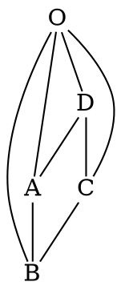

# Ejercicio 1
Sea $X =$ número de neumáticos de un automóvil, seleccionado al azar, que tenga baja la presión.

## a
¿Cuál de las siguientes tres funciones $p(.)$ es una función de probabilidad de masa para $X$? Justifique.

| x | 0 | 1 | 2 | 3 | 4 |
|---|---|---|---|---|---|
| $p(x)$ | 0.3 | 0.2 | -0.1 | 0.5 | 0.1 |
| $p(x)$ | 0.4 | 0.1 | 0.1 | 0.1 | 0.3 |
| $p(x)$ | 0.4 | 0.1 | 0.2 | 0.1 | 0.3 |

- La primera tiene valores negativos.
- La última nos da $∑_{i∈I} p(a_i) = 1.1 \ne 1$.
- La segunda es positiva y su sumatoria es igual a $1$, por ende es la correcta.

## b
Con la función de probabilidad de masa obtenida en $(a)$, calcular: $P(2 ≤ X ≤ 4), P (X ≤ 2)$ y $P (X \ne 0)$.

$$
\begin{gather*}
  P(2 ≤ X ≤ 4) &=& F(4) - \lim_{x \to 2^{-}}F(x) \\
  &=& 1 - (0.4 + 0.1) \\
  &=& 0.5 \\
  \\
  P(X ≤ 2) &=& F(2) \\
  &=& 0.4 + 0.1 + 0.1 \\
  &=& 0.6 \\
  \\
  P(X \ne 0) &=& 1 - P(x = 0) \\
  &=& 1 - F(0) \\
  &=& 1 - 0.4 \\
  &=& 0.6 \\
\end{gather*}
$$

## c
Obtener la función de distribución acumulada de $X$.

$$
F(x) =
\begin{cases}
  0 &,& x \lt 0 \\
  0.4 &,& 0 \le x \lt 1 \\
  0.5 &,& 1 \le x \lt 2 \\
  0.6 &,& 2 \le x \lt 3 \\
  0.7 &,& 3 \le x \lt 4 \\
  1 &,& 4 \le x
\end{cases}
$$

## d
Si $p(x) = k (5 − x)$ para $x = 0, 1, 2, 3, 4$, ¿cuál debe ser el valor de la constante $k$ para que $p$ sea una función de probabilidad de masa?

$$
\begin{gather*}
  1 &=& \sum _{x = 0} ^4 p(x) \\
  &=& (5k + 4k + 3k + 2k + k) \\
  &=& 15k \\
  \frac 1 {15} &=& k \\
\end{gather*}
$$

# Ejercicio 2
Un negocio de computadoras que atiende pedidos por correo tiene seis líneas telefónicas. Denotemos por $X$ el número de líneas en uso en un momento específico. Supongamos que la función de probabilidad de masa de $X$ está dada en la siguiente tabla:

| x | 0 | 1 | 2 | 3 | 4 | 5 | 6 |
|---|---|---|---|---|---|---|---|
| $p(x)$ | 0.10 | 0.15 | 0.20 | 0.25 | 0.20 | 0.06 | 0.04 |

Calcular la probabilidad de cada uno de los siguientes eventos:

### a
$A=$ A lo sumo tres líneas están en uso.

$$
\begin{gather*}
  P(X ≤ 3) &=& (0.1 + 0.15 + 0.2 + 0.25) \\
  &=& 0.7
\end{gather*}
$$

### b
$B=$ Menos de tres líneas están en uso.

$$
\begin{gather*}
  P(X \lt 3) &=& 1 - P(3 \le X) \\
  &=& 1 - P(3 \le X \le 6) \\
  &=& 1 - (F(6) - \lim_{x \to 3^{-}}F(x)) \\
  &=& 1 - (1 - (0.1 + 0.15 + 0.2)) \\
  &=& 1 - (1 - 0.45) \\
  &=& 1 - 0.55 \\
  &=& 0.45
\end{gather*}
$$

### c
$C=$ Por lo menos tres líneas están en uso.

$$
\begin{gather*}
  P(3 \le X) &=& P(3 \le X \le 6) \\
  &=& F(6) - \lim_{x \to 3^{-}}F(x) \\
  &=& 1 - (0.1 + 0.15 + 0.2) \\
  &=& 1 - (1 - (0.1 + 0.15 + 0.2)) \\
  &=& 1 - 0.45 \\
  &=& 0.55
\end{gather*}
$$

### d
$D=$ Entre 2 y 5 líneas están en uso.

$$
\begin{gather*}
  P(2 \le X \le 5) &=& F(5) - \lim_{x \to 2^{-}}F(x) \\
  &=& (0.10 + 0.15 + 0.20 + 0.25 + 0.20 + 0.06) - (0.10	+ 0.15) \\
  &=& 0.96 - 0.25 \\
  &=& 0.71
\end{gather*}
$$

### e
$E=$ Entre 2 y 4 líneas no están en uso.

> Si $2$ líneas están en uso, $4$ no lo están, si $4$ lo están, $2$ no y si $3$ están en uso, $3$ no. Entonces es lo mismo cacular $E$ que calcular "Entre 2 y 4 líneas están en uso".

$$
\begin{gather*}
  P(2 \le X \le 4) &=& (F(4) - \lim_{x \to 2^{-}}F(x)) \\
  &=& ((0.10 + 0.15 + 0.20 + 0.25 + 0.20) - (0.10	+ 0.15)) \\
  &=& (0.9 - 0.25) \\
  &=& 0.65
\end{gather*}
$$

### f
$F=$ Por lo menos 4 líneas no están en uso.

> Es lo mismo que decir que como mucho $2$ están en uso.

$$
\begin{gather*}
  P(X \le 2) &=& (0.1 + 0.15 + 0.2) \\
  &=& 0.45
\end{gather*}
$$

### g
Obtener la función de distribución acumulada de $X$.

$$
F(x) =
\begin{cases}
  0 &,& x \lt 0 \\
  0.1 &,& 0 \le x \lt 1 \\
  0.25 &,& 1 \le x \lt 2 \\
  0.45 &,& 2 \le x \lt 3 \\
  0.7 &,& 3 \le x \lt 4 \\
  0.9 &,& 4 \le x \lt 5 \\
  0.96 &,& 5 \le x \lt 6 \\
  1 &,& 6 \le x
\end{cases}
$$

# Ejercicio 3
Una compañía de seguros ofrece a sus clientes varias opciones diferentes para el pago de primas. Para un cliente seleccionado al azar, sea $X =$ número de meses entre pagos sucesivos. La función de distribución acumulada de $X$ es como sigue:

$$
F(x) =
\begin{cases}
  0 &,& x \lt 1 \\
  0.3 &,& 1 \le x \lt 3 \\
  0.4 &,& 3 \le x \lt 4 \\
  0.45 &,& 4 \le x \lt 6 \\
  0.6 &,& 6 \le x \lt 12 \\
  1 &,& 12 \le x
\end{cases}
$$

## a 
¿Cuál es la función de probabilidad de masa de $X$?

| x | 1 | 3 | 4 | 6 | 12 |
|---|---|---|---|---|---|
| $p(x)$ | 0.3 | 0.1 | 0.05 | 0.15 | 0.4 |

## b
Sólo con el uso de la función de distribución acumulada, calcule $P(3 ≤ X ≤ 6)$ y $P(4 ≤ X)$.

$$
\begin{gather*}
  P(3 ≤ X ≤ 6) &=& F(6) - \lim_{x \to 3} F(x) \\
  &=& 0.6 - 0.3 \\
  &=& 0.3 \\
\\
  P(4 ≤ X) &=& 1 - \lim_{x \to 4} F(x) \\
  &=& 1 - 0.4 \\
  &=& 0.6 \\
\end{gather*}
$$

# Ejercicio 4
Considere un grupo de cinco personas, $A, B, C, D$ y $E$, que son potenciales donantes de sangre. Se necesita un donante de sangre tipo $O+$ y, de estas personas, solo $A$ y $B$ tienen dicho grupo sanguíneo. Un laboratorio tomará una muestra de sangre de cada persona y determinará en orden aleatorio el grupo sanguíneo, hasta encontrar la primera muestra $O+$. Considere la variable aleatoria $X$, que cuenta el número de determinaciones necesarias.

## a
Encuentre la función de probabilidad de masa de $X$.

- Para una única muestra necesaria, tenemos $2$ posibilidades $A$ o $B$.  
- Para $2$ muestras necesarias, tenemos $3*2$ posibilidades, cualesquiera de los $C, D$ o $E$ y $A$ o $B$.
- Para $3$ muestras necesarias, tenemos $3*2*2$ posibilidades, $2$ cualesquiera de los $C, D$ o $E$ y $A$ o $B$.
- Para $4$ muestras necesarias, tenemos $3*2*1*2$ posibilidades, $2$ todos los $C, D$ o $E$ y $A$ o $B$.
- Para $5$ es trivial, ya que a la $4$ muestra ya se encontró uno.

| x | 1 | 2 | 3 | 4 |
|---|:---:|:---:|:---:|:---:|
| $p(x)$ | $\frac 2 5$ | $\frac 6 {20}$ | $\frac {12} {60}$ | $\frac {12} {120}$ |
| $p(x)$ | $0.4$ | $0.3$ | $0.2$ | $0.1$ |

## b
A partir de la función obtenida en $a)$, calcule la probabilidad de que al determinar el grupo sanguíneo de las dos primeras muestras no se encuentre el grupo buscado.

$$
\begin{gather*}
  P(3 ≤ X) &=& 1 - \lim_{x \to 3} F(x) \\
  &=& 1 - 0.7 \\
  &=& 0.3
\end{gather*}
$$

# Ejercicio 5
Silvina vive en el punto O del siguiente diagrama y tiene cuatro amigos que viven en $A, B, C$ y $D$. Un día Silvina decide ir de visita, así que lanza al aire dos veces una moneda para decidir a cuál de los cuatro ir a visitar. Una vez que está en la casa de un amigo, o regresa a su casa o continúa a una de las dos casas adyacentes, teniendo para cada una de las tres posibilidades una probabilidad de $1/3$. Así continúa Silvina de visita a amigos hasta que regresa a casa. Notar que Silvina puede visitar a cada amigo más
de una vez.

## a
Sea $X=$ _número de visitas que realiza_. Obtener la función de probabilidad de masa de $X$.

| x | 1 | 2 | 3 | $\dots$ | n |
|---|:---:|:---:|:---:|:---:|:---:|
| $p(x)$ | $\frac 1 3$ | $\frac 2 9$ | $\frac 4 {27}$ | $\dots$ | $\frac {2^{n-1}} {3^n}$ |

| x | $c.c$ | n |
|---|:---:|:---:|
| $F(x)$ | $0$ | $\frac {2^{n-1}} {3^n}$ |

## b
Obtener la función de distribución acumulada de $X$.

| x | 1 | 2 | 3 | $\dots$ | n |
|---|:---:|:---:|:---:|:---:|:---:|
| $F(x)$ | $\frac 1 3$ | $\frac 5 9$ | $\frac {19} {27}$ | $\dots$ | $1 - (\frac 2 3)^n$ |

| x | $x \lt 1$ | $1 \le x$ |
|---|:---:|:---:|
| $F(x)$ | $0$ | $1 - (\frac 2 3)^n$ |

## c
Sea $Y=$ _número de segmentos que transita Silvina_. Obtener la función de probabilidad de masa de $Y$.

| y | 2 | 3 | 4 | $\dots$ | n |
|---|:---:|:---:|:---:|:---:|:---:|
| $p(y)$ | $\frac 1 3$ | $\frac 2 9$ | $\frac 4 {27}$ | $\dots$ | $\frac {2^{n-2}} {3^{n-1}}$ |

| x | $c.c$ | n |
|---|:---:|:---:|
| $F(x)$ | $0$ | $\frac {2^{n-1}} {3^n}$ |

# Ejercicio 6
Sea $X=$ _resultado cuando un dado no cargado se hace rodar una vez_.

## a
Calcular la esperanza de $X$ y de $1/X$.

$$
\begin{gather*}
  E(X) &=& \sum _{i=1} ^6 x_i p(x_i) \\
  &=& \frac 1 6 + \frac 2 6 + \frac 3 6 + \frac 4 6 + \frac 5 6 + 1 \\
  &=& 0.5 + 1 + 1 + 1 \\
  &=& 3.5 \\
\\
  E(1/X) &=& \sum _{i=1} ^6 \frac 1 {x_i} p(x_i) \\
  &=& \frac 1 6 + \frac 1 2 \frac 1 6 + \frac 1 3 \frac 1 6 + \frac 1 4 \frac 1 6 + \frac 1 5 \frac 5 6 + \frac 1 6 \frac 1 6 \\
  &=& 0.4083
\end{gather*}
$$

## b
Si antes de arrojar el dado se ofrece al tirador retirarse con $(1/3.5)$ dólares o jugar obteniendo $h(X) = (1/X)$ dólares, ¿le conviene retirarse o jugar? Justifique.

> Le conviene jugar, ya que el resultado esperado es de $0.4083 \gt \frac 1 {3.5} = 0.2857$

# Ejercicio 7
Un distribuidor de aparatos electrodomésticos vende tres modelos de diferentes congeladores verticales con capacidad de $13.5, 15.9$ y $19.1$ pies cúbicos de espacio de almacenaje, respectivamente. Sea $X$ la cantidad de espacio de almacenaje comprado por un cliente que va a comprar un congelador. Supongamos que $X$ tiene la siguiente distribución de probabilidad:

| x | 13.5 | 15.9 | 19.1 |
|---|:---:|:---:|:---:|
| $p(x)$ | 0.2 | 0.5 | 0.3 |

## a
Calcular $E(X), E(X^2)$ y $V(X)$.

$$
\begin{gather*}
  E(X) &=& \sum _{i \in I} x_i p(x_i) \\
  &=& 13.5 * 0.2 + 15.9 * 0.5 + 19.1 * 0.3 \\
  &=& 2.7 + 7.95 + 5.73 \\
  &=& 16.38 \\
\\
  E(X^2) &=& \sum _{i=1} ^6 x_i^2 p(x_i) \\
  &=& 182.25 * 0.2 + 252.81 * 0.5 + 364.81 * 0.3 \\
  &=& 36.45 + 126.405 + 109.443 \\
  &=& 272.298 \\
\\
  V(X) &=& E(X^2) - E(X)^2 \\
  &=& 272.298 - (16.38)^2 \\
  &=& 272.298 + 268.3044 \\
  &=& 3.9936 \\
\end{gather*}
$$

## b
Si el precio de un congelador que tiene una capacidad de $X$ pies cúbicos es de $25X − 8.5$, ¿cuál es la esperanza y varianza del precio pagado por un cliente que va a comprar un congelador?

$$
\begin{gather*}
  E(aX + b) &=& aE(X) + b \\
  &=& 25(16.38) - 8.5 \\
  &=& 409.5 - 8.5 \\
  &=& 401 \\
\\
  V(aX + b) &=& a^2 V(X) \\
  &=& (25)^2 * 3.9936 \\
  &=& 625 * 3.9936 \\
  &=& 2496 \\
\end{gather*}
$$

## c
Suponga que mientras la capacidad nominal de un congelador es $X$, la capacidad real es $h (X) = X − 0.01X^2$. ¿Cuál es la capacidad real esperada del congelador comprado por un cliente?

$$
\begin{gather*}
  E(X − 0.01X^2) &=& \sum _{i \in I} (x_i − 0.01x_i^2) p(x_i) \\
  &=& (13.5 - 1.8225) * 0.2 + (15.9 - 2.5281) * 0.5 + (19.1 - 3.6481) * 0.3 \\
  &=& 11.6775 * 0.2 + 13.3719 * 0.5 + 15.4519 * 0.3 \\
  &=& 2.33550 + 6.68595 + 4.63557 \\
  &=& 13.65702 \\
\end{gather*}
$$

# Ejercicio 8
Considere la variable aleatoria $X$ del ejercicio $4$.

## a
Encuentre la esperanza y la desviación estándar de $X$.

$$
\begin{gather*}
  E(X) &=& 1 * 0.4 + 2 * 0.3 + 3 * 0.2 + 4 * 0.1 \\
  &=& 0.4 + 0.6 + 0.6 + 0.4 \\
  &=& 2 \\
\\
  E(X^2) &=& 1 * 0.4 + 4 * 0.3 + 9 * 0.2 + 16 * 0.1 \\
  &=& 0.4 + 1.2 + 1.8 + 1.6 \\
  &=& 5 \\
\\
  \sigma &=& \sqrt {V(X)} \\
  &=& \sqrt {E(X²) - E(X)²} \\
  &=& \sqrt {5 - 2²} \\
  &=& \sqrt {5 - 4} \\
  &=& \sqrt 1 \\
  &=& 1 \\
\end{gather*}
$$

## b
Si la determinación del grupo sanguíneo de cada muestra le cuesta al laboratorio $\$200$, ¿cuál es el costo esperado para realizar las determinaciones necesarias hasta encontrar el donante? ¿Y la varianza del costo?

$$
\begin{gather*}
  E(aX + b) &=& aE(X) + b \\
  &=& 200 E(X) + 0 \\
  &=& 200 * 2 \\
  &=& 400 \\
\\
  V(X) &=& \sigma² \\
  V(aX + b) &=& a²V(x) \\
  &=& a²\sigma² \\
  &=& (200)² * 1² \\
  &=& 40000
\end{gather*}
$$

# Ejercicio 9
Suponga que sólo el $20\%$ de los automovilistas se detienen por completo en un cruce donde hay un semáforo con luz roja intermitente en todas las direcciones, cuando no haya otros automóviles visibles.
Si se seleccionan al azar $20$ automovilistas que llegan al cruce en estas condiciones:

> Distribución Binomial

## a
¿Cuál es la probabilidad de que

### i
exactamente $3$ se detengan por completo?

- Las posibles combinaciones de $3$ tomas de un conjunto de $20$ son el caso que queremos analizar, las probabilidades de que ocurran esos se detengan es de $0.2^3$ y de que el resto no es de $\frac 4 5 ^{17}$

$$
\begin{gather*}
  \frac 2 {10} ^3 \binom {20} 3 \frac 4 5 ^{17} \overset{\sim} = 0.2054; 
\end{gather*}
$$

### ii
a lo sumo $3$ se detengan por completo?

$$
\begin{gather*}
  \sum_{i=0} ^3 \frac 2 {10} ^i \binom {20} i \frac 4 5 ^{20 - i} &=& \frac 4 5 ^{20} + \frac 2 {10} 20 \frac 4 5 ^{19} + \frac 2 {10} ^2 190 \frac 4 5 ^{18} + \frac 2 {10} ^3 \binom {20} 3 \frac 4 5 ^{17} \\
  &\overset{\sim} =& \frac 4 5 ^{20} + 4 \frac 4 5 ^{19} + 4 * 1.9 \frac 4 5 ^{18} + 0.2054 \\
  &\overset{\sim} =& 0.0115 + 0.0576 + 0.137 + 0.2054 \\
  &\overset{\sim} =& 0.4115;
\end{gather*}
$$

### iii
por lo menos $3$ se detengan por completo?

$$
\begin{gather*}
  \sum_{i=3} ^{20} \frac 2 {10} ^i \binom {20} i \frac 4 5 ^{20 - i} &\overset{\sim} =& 0.7939;
\end{gather*}
$$

## b
¿Cuántos automovilistas espera el lector que se detengan por completo?

> $20 * 0.2 = 4$ 

# Ejercicio 10
Un tipo particular de raqueta de tenis se fabrica en tamaños mediano y extragrande. El $60\%$ de todos los clientes, de cierta tienda, buscan el tamaño extragrande.

> Distribución Binomial

## a
Entre $10$ clientes seleccionados al azar que desean ese tipo de raqueta, ¿cuál es la probabilidad de que por lo menos $6$ busquen el tamaño extragrande?

$$
\begin{gather*}
  \sum_{i=6} ^{10} \frac 3 5 ^i \binom {10} i \frac 2 5 ^{10 - i} &\overset{\sim} =& 0.6331
\end{gather*}
$$

## b
Entre $10$ clientes seleccionados al azar que desean ese tipo de raqueta, ¿cuál es la probabilidad de que el número de clientes que buscan el tamaño extragrande esté dentro de una desviación estándar del valor medio?

- Calculamos el valor medio $0.6 * 10 = 6$.
- Calculamos la variación estándar $n * p * (1 - p) = 10 * 0.6 * 0.4 = 2.4$, o sea que la desviación estándar es de $1.5492$.

$$
\begin{gather*}
  P(\bar X - \sigma \le X \le \bar X + \sigma) &=& P(4.4508 \le X \le 7.5492) \\
  &=& \sum_{i=5} ^7 \frac 3 5 ^i \binom {10} i \frac 2 5 ^{10 - i} \\
  &=& 0.6665 \\
\end{gather*}
$$

## c
La tienda tiene actualmente $6$ raquetas de cada modelo. ¿Cuál es la probabilidad de que los siguientes diez clientes que buscan esta raqueta puedan comprar el modelo que buscan, de entre el stock actual?

- La cantidad de $X$ tiene que ser menor o igual que $6$, pero sabemos también que los que compren mediana, también tiene que ser menor o igual que $6$, por ende, si $X$ es menor a $4$, los de mediana serían mayores a $6$, por ende $4 \le X \le 6$

$$
\begin{gather*}
  P(4 \le X \le 6) &=& \sum_{i=4} ^6 \frac 3 5 ^i \binom {10} i \frac 2 5 ^{10 - i} \\
  &\overset{\sim} =& 0.563
\end{gather*}
$$

# Ejercicio 11
De todas las reparaciones hechas en aparatos de TV en cierta tienda, el $85\%$ se hace en aparatos que ya no tienen garantía.

> Es un problema con distribución binomial.

## a
Entre $16$ aparatos llevados a reparación, ¿cuál es el número esperado de aparatos que ya no tengan garantía?

$$
\begin{gather*}
  E(X) &=& np \\
  &=& 16 * 0.85 \\
  &=& 13.6
\end{gather*}
$$

## b
Entre $16$ aparatos llevados a reparación, ¿cuál es el número esperado de aparatos que tienen garantía?

$$
\begin{gather*}
  E(\bar X) &=& n(1 - p) \\
  &=& 16 * (1 - 0.85) \\
  &=& 16 * 0.15 \\
  &=& 2.4
\end{gather*}
$$

## c
Entre $16$ aparatos llevados a reparación, ¿cuál es la probabilidad de que por lo menos el $75\%$ ya no tengan garantía?

- Calculamos primero el porcentaje: $16 * 0.75 = 12$

$$
\begin{gather*}
  P(12 \le X \le 16) &=& \sum_{i=12} ^{16} \binom{16} i (0.85)^i (0.15)^{16-i} \\
  &=& 0.921
\end{gather*}
$$

## d
Suponga que hay $10$ aparatos ahora en la tienda, de los cuales $3$ tienen garantía. Si se eligen al azar $5$ de los $10$ para ser llevados a reparación, ¿cuál es la función de probabilidad de masa de $X=$ número de aparatos sin garantía entre los $5$ reparados? ¿Cuánto vale $E(X)$ y $V(X)$?

> Este problema es de distribución HiperGeométrica, tenemos una población de $N = 10$, una muestra de $n = 5$ y casos de éxito de $M = 7$.

$$
p(x) = 
\begin{cases}
  0 &,& c.c. \\
  \frac {\binom 7 x \binom 3 {5-x}} {\binom {10} 5} &,& 2 \le x \le 5
\end{cases}
$$

| x | 2 | 3 | 4 | 5 | $c.c.$ |
|---|:---:|:---:|:---:|:---:|:---:|
| $p(x)$ | 0.0833 | 0.4167 | 0.4167 | 0.0833 | 0 |

- Y de acá sacamos que

$$
\begin{gather*}
  E(X) &=& n * \frac M N \\
  &=& 5 * \frac 7 {10} \\
  &=& 3.5 \\
\\
  B(X) &=& n * \frac M N * \left(1 - \frac M N\right) * \frac {N - n} {N - 1} \\
  &=& 5 * \frac 7 {10} * \frac 3 {10} * \frac 5 9 \\
  &=& \frac 7 2 * \frac 1 2 * \frac 1 3 \\
  &=& \frac 7 {12} \\
  &=& 0.5833
\end{gather*}
$$

# Ejercicio 12
Cada uno de $12$ refrigeradores de cierto tipo ha sido devuelto a un distribuidor debido a la presencia de un ruido oscilante agudo cuando está funcionando. Supongamos que $4$ de esos $12$ tienen compresores defectuosos y los otros $8$ tienen problemas menos serios. Si se examinan $6$ refrigeradores al azar, sea $X=$ número de refrigeradores que tienen el compresor defectuoso entre los $6$ examinados.

> Este problema es de distribución HiperGeométrica, tenemos una población de $N = 12$, una muestra de $n = 6$ y casos de éxito de $M = 4$.

$$
p(x) = 
\begin{cases}
  0 &,& c.c. \\
  \frac {\binom 4 x \binom 8 {6-x}} {\binom {12} 6} &,& 0 \le x \le 4
\end{cases}
$$

## a
Calcular: 

### i
$$
P (X = 1)
$$

$$
\begin{gather*}
  P(X = 1) &=& \frac {\binom 4 1 \binom 8 {6-1}} {\binom {12} 6} \\
  &=& \frac {4 \binom 8 5} {924} \\
  &=& \frac {4 * 56} {924} \\
  &=& 4 * \frac 2 {33} \\
  &=& 0. \overline {24}
\end{gather*}
$$

### ii 
$$
P (X ≥ 4)
$$

$$
\begin{gather*}
  P(X \ge 4) &=& \frac {\binom 4 4 \binom 8 {6-4}} {\binom {12} 6} \\
  &=& \frac {\binom 8 2} {924} \\
  &=& \frac {4 * 7} {924} \\
  &=& \frac 4 {132} \\
  &=& \frac 1 {33} \\
  &=& 0. \overline {03}
\end{gather*}
$$

### iii
$$
P (1 ≤ X ≤ 3)
$$

$$
\begin{gather*}
  P(X = 2) &=& \frac {\binom 4 2 \binom 8 {6-2}} {\binom {12} 6} \\
  &=& \frac {3*2 \binom 8 4} {924} \\
  &=& \frac {6 * 7*2*5} {924} \\
  &=& \frac {6 * 2*5} {132} \\
  &=& \frac {6 * 5} {66} \\
  &=& \frac 5 {11} \\
  &=& 0. \overline {45} \\
\\
  P(X = 3) &=& \frac {\binom 4 3 \binom 8 {6-3}} {\binom {12} 6} \\
  &=& \frac {4 \binom 8 3} {924} \\
  &=& \frac {4 \binom 8 5} {924} \\
  &=& 0. \overline {24} \\
\\
  P(1 \le X \le 3) &=& P(X = 1) + P(X = 2) + P(X = 3) \\
  &=& 0. \overline {24} + 0. \overline {45} + 0. \overline {24} \\
  &=& 0. \overline {48} + 0. \overline {45} \\
  &=& 0. \overline {93}
\end{gather*}
$$

## b
¿Cuánto vale $E(X)$ y $V(X)$?

$$
\begin{gather*}
  E(X) &=& n * \frac M N \\
  &=& 6 * \frac 4 {12} \\
  &=& 6 * \frac 1 3 \\
  &=& 2 \\
\\
  V(X) &=& n * \frac M N * \left(1 - \frac M N\right) * \frac {N - n} {N - 1} \\
  &=& 6 * \frac 4 {12} * \frac 8 {12} * \frac {12 - 6} {11} \\
  &=& 6 * \frac 1 3 * \frac 2 3 * \frac 6 {11} \\
  &=& 2 * 2 * \frac 2 {11} \\
  &=& \frac 8 {11} \\
  &=& 0. \overline {72}
\end{gather*}
$$

# Ejercicio 13
Boca y River hacen una serie de partidos en los que si hay empate se define por penales. Suponga que $p = P (\text{gana Boca})=0.5$. Jugarán hasta que Boca gane dos partidos.

## a
¿Cuál es la probabilidad de que River gane $x$ partidos?

> Si River gana $x$ partidos, eso significa que se jugaron $x + 2$ partidos, donde el último lo ganó Boca. Por ende, las posibles combinaciones son de $x$ tomas en un conjunto de $x + 1$ elementos. Notamos además, que es de Distribución Binomial.

$$
\begin{gather*}
  P(\text{gana River } x \text{ partidos}) &=& \left(\binom {x+1} x (0.5)^x (0.5) \right) * (0.5)\\
  &=& (x + 1)(0.5)^{x + 2} \\
\end{gather*}
$$

## b
¿Cuál es la probabilidad de que se jueguen $4$ partidos?

$$
\begin{gather*}
  P(\text{gana River } 2 \text{ partidos}) &=& (2 + 1)(0.5)^{2 + 2} \\
  &=& 3(0.5)^4 \\
  &=& \frac 3 {16} \\
  &=& 0.1875
\end{gather*}
$$

## c
¿Cuál es la probabilidad de que se jueguen a lo sumo $4$ partidos?

$$
\begin{gather*}
  \sum_{x=0} ^2 P(\text{gana River } x \text{ partidos}) &=& (0 + 1)(0.5)^{0 + 2} + (1 + 1)(0.5)^{1 + 2} + 0.1875 \\
  &=& 1(0.5)^2 + 2(0.5)^3 + 0.1875 \\
  &=& 0.25 + (0.5)^2 + 0.1875 \\
  &=& 0.25 + 0.25 + 0.1875 \\
  &=& 0.5 + 0.1875 \\
  &=& 0.6875
\end{gather*}
$$

## d
¿Cuántos partidos se esperaría que gane River? ¿Cuántos partidos se esperaría que se jueguen?

$$
\begin{gather*}
  E(\text{partidos ganados por River}) &=& \sum_{x=0} ^\infty x(x+1)(0.5)^{x+2} \\
  &=& 0.5 \sum_{x=0} ^\infty \frac {x(x+1)} {2^{x+1}} \\
  &=& 0.5 \sum_{x=0} ^\infty \left(\frac {x^2} {2^{x+1}} + \frac x {2^{x+1}} \right) \\
  &=& 0.5 \left(\sum_{x=0} ^\infty \frac {x^2} {2^{x+1}} + \sum_{x=0} ^\infty \frac x {2^{x+1}} \right) \\
\end{gather*}
$$

- Calculamos por partes

$$
\begin{gather*}
  \sum_{x=0} ^\infty \left(\frac {x+1} {2^{x+1}} - \frac x {2^x} \right) &=& \lim_{x\to \infty} \frac {x+1} {2^{x+1}} - \frac 0 {2^0} \\
  &=& 0.5 \lim_{x\to \infty} \frac {x+1} {2^x} - 0 \\
  &=& 0.5 \lim_{x\to \infty} \frac 1 {\log 2 * 2^x} \\
  &=& 0.5 * \frac 1 {\log 2} \lim_{x\to \infty} \frac 1 {2^x} \\
  &=& 0.5 * \frac 1 {\log 2} * 0 \\
  &=& 0 \\
\\
  0 &=& \sum_{x=0} ^\infty \left(\frac {x+1} {2^{x+1}} - \frac {2x} {2^{x+1}} \right) \\
  &=& \sum_{x=0} ^\infty \left(\frac {x+1 -2x} {2^{x+1}} \right) \\
  &=& \sum_{x=0} ^\infty \left(\frac {1 -x} {2^{x+1}} \right) \\
  &=& \sum_{x=0} ^\infty \left(\frac 1 {2^{x+1}} - \frac x {2^{x+1}} \right) \\
  &=& \sum_{x=0} ^\infty \frac 1 {2^{x+1}} - \sum_{x=0} ^\infty \frac x {2^{x+1}} \\
  \sum_{x=0} ^\infty \frac x {2^{x+1}} &=& \sum_{x=0} ^\infty \frac 1 {2^{x+1}} \\
  &=& \sum_{x=1} ^\infty \frac 1 {2^x} \\
  &=& 1 \\
\\
  \sum_{x=0} ^\infty \left(\frac {(x+1)^2} {2^{x+1}} - \frac {x^2} {2^x} \right) &=& \lim_{x\to \infty} \frac {(x+1)^2} {2^{x+1}} - \frac {0^2} {2^0} \\
  &=& 0.5 \lim_{x\to \infty} \frac {(x+1)^2} {2^x} - 0 \\
  &=& 0.5 \lim_{x\to \infty} \frac {2(x + 1)} {\log 2 * 2^x} \\
  &=& \frac 1 {\log 2} \lim_{x\to \infty} \frac {x + 1} {2^x} \\
  &=& \frac 1 {\log 2} \lim_{x\to \infty} \left( \frac x {2^x} +  \frac 1 {2^x} \right) \\
  &=& \frac 1 {\log 2} \left( \lim_{x\to \infty} \frac x {2^x} + \lim_{x\to \infty} \frac 1 {2^x} \right) \\
  &=& \frac 1 {\log 2} (0 + 0) \\
  &=& 0 \\
\\
  0 &=& \sum_{x=0} ^\infty \left(\frac {x^2 + 2x + 1} {2^{x+1}} - \frac {2x^2} {2^{x+1}} \right) \\
  &=& \sum_{x=0} ^\infty \left(\frac {2x + 1} {2^{x+1}} - \frac {x^2} {2^{x+1}} \right) \\
  &=& \sum_{x=0} ^\infty \frac {2x + 1} {2^{x+1}} - \sum_{x=0} ^\infty \frac {x^2} {2^{x+1}} \\
  \sum_{x=0} ^\infty \frac {x^2} {2^{x+1}} &=& \sum_{x=0} ^\infty \frac {2x + 1} {2^{x+1}} \\
  &=& \sum_{x=0} ^\infty \frac {2x} {2^{x+1}} + \sum_{x=0} ^\infty \frac 1 {2^{x+1}} \\
  &=& 2\sum_{x=0} ^\infty \frac x {2^{x+1}} + \sum_{x=1} ^\infty \frac 1 {2^x} \\
  &=& 2*1 + 1 \\
  &=& 3 \\
\end{gather*}
$$

- Y resolvemos

$$
\begin{gather*}
  E(\text{partidos ganados por River}) &=& 0.5 \left(\sum_{x=0} ^\infty \frac {x^2} {2^{x+1}} + \sum_{x=0} ^\infty \frac x {2^{x+1}} \right) \\
  &=& 0.5 (3 + 1) \\
  &=& 0.5 * 4 \\
  &=& 2
\end{gather*}
$$

> Por ende, se espera que River gane $2$ partidos y se jueguen un total de $4$ partidos.

# Ejercicio 14
Suponga que $X=$ número de tornados observados, en una región particular, durante un período de un año tiene distribución de $Poisson$ con $λ = 8$.

## a
Calcular: $P(X ≤ 5), P(6 ≤ X ≤ 9), P(10 ≤ X)$ y $P(X ≥ 1)$.

$$
\begin{gather*}
  P(X ≤ 5) &=& e^{-\lambda} \frac{\lambda^0}{0!} + \dots + e^{-\lambda} \frac{\lambda^5}{5!} \\
  &=& e^{-8} + e^{-8} * 8 + e^{-8} \frac{8^2}{2!} + e^{-8} \frac{8^3}{3!} + e^{-8} \frac{8^4}{4!} + e^{-8} \frac{8^5}{5!} \\
  &=& \frac 1 {e^8} + \frac 8 {e^8} + \frac {32} {e^8} + \frac {85.\overline{3}} {e^8} + \frac {170.\overline{6}} {e^8} + \frac {273.0\overline{6}} {e^8} \\
  &=& \frac {1 + 8 + 32 + 85.\overline{3} + 170.\overline{6} + 273.0\overline{6}} {e^8} \\
  &=& \frac {570.0\overline{6}} {e^8} \\
  &=& 0.1912 \\
\\
  P(6 ≤ X ≤ 9) &=& \frac {364.0\overline8} {e^8} + \frac {416.101587302} {e^8} + \frac {416.101587302} {e^8} + \frac {369.868077601} {e^8} \\
  &=& \frac {364.0\overline8 + 416.101587302 + 416.101587302 + 369.868077601} {e^8} \\
  &=& \frac {1566.16014109} {e^8} \\
  &=& 0.5254 \\
\\
  P(X ≤ 10) &=& P(6 ≤ X ≤ 9) + P(X ≤ 5) + P(X=10) \\
  &=& 0.5254 + 0.1912 + 0.0993 \\
  &=& 0.8159 \\
\\
  P(X ≥ 1) &=& 1 - P(X \lt 1) \\
  &=& 1 - P(X = 0) \\
  &=& 1 - e^{-8} \frac{8^0}{0!} \\
  &=& 1 - e^{-8} \\
  &=& 1 - 0.000335 \\
  &=& 0.99966
\end{gather*}
$$

## b
¿Cuántos tornados se puede esperar que se observen durante un período de un año? ¿Cuál es la desviación estándar de $X$?

$$
\begin{gather*}
  E(X) &=& \lambda \\
  &=& 8 \\
\\
  \sigma &=& \sqrt {V(X)} \\
  &=& \sqrt {\lambda} \\
  &=& \sqrt 8 \\
  &=& 2 \sqrt 2 \\
  &=& 2.8284
\end{gather*}
$$

# Ejercicio 15
Un estacionamiento tiene dos entradas. Los coches llegan por hora a la entrada $I$ de acuerdo con una distribución de $Poisson$ de parámetro $λ = 3$ y a la entrada $II$ de acuerdo con una distribución de $Poisson$ de parámetro $λ = 4$. ¿Cuál es la probabilidad de que $3$ coches lleguen al estacionamiento durante una hora dada? (Se supone que los números de coches que llegan a los dos entradas son independientes).

$$
\begin{gather*}
  E(X=3) &=& \sum_{k=0} ^3 \left( e^{-3} \frac{3^k}{k!} * e^{-4} \frac{4^{3-k}}{(3-k)!} \right) \\
  &=& \sum_{k=0} ^3 \left( e^{-7} \frac{3^k * 4^{3-k}}{k! * (3-k)!} \right) \\
  &=& e^{-7} \sum_{k=0} ^3 \left( \frac{3^k * 4^{3-k}}{k! * (3-k)!} \right) \\
  &=& e^{-7} \left(\frac {1 * 4^3} {1 * 6} + \frac {3 * 4^2} {1 * 2} + \frac {3^2 * 4} {2 * 1} + \frac {3^3 * 1} {6 * 1} \right) \\
  &=& e^{-7} \left(\frac {32} 3 + 24 + 18 + \frac 9 2 \right) \\
  &=& e^{-7} (10.\overline6 + 42 + 4.5) \\
  &=& e^{-7} (57.\overline1) \\
  &=& 0.05207
\end{gather*}
$$

# Ejercicio 16
Se supone que el número de defectos $Y$ (por cm) de la producción diaria de cierto tipo de soga tiene una distribución de $Poisson$ con una media de $2$. Cuando se vende la soga, la ganancia por cm está dada por $X = 50 − 2Y − Y^2$. Dar la ganancia esperada por cm.

$$
\begin{gather*}
  E(Y) &=& \lambda \\
  &=& 2 \\
\\
  V(Y) &=& E(Y^2) - E(Y)^2 \\
  \lambda &=& E(Y^2) - 2^2 \\
  2 &=& E(Y^2) - 4 \\
  6 &=& E(Y^2) \\
\\
  E(X) &=& E(50 − 2Y − Y^2) \\
  &=& 50 - 2E(Y) - E(Y^2) \\
  &=& 50 - 2*2 - 6 \\
  &=& 44 - 4 \\
  &=& 40 \\
\end{gather*}
$$

# Ejercicio 17
## a
Hallar la esperanza y varianza para una variable aleatoria con distribución Hipergeométrica.

$$
\begin{gather*}
  E(X) &=& n * \frac M N \\
\\
  V(X) &=& n * \frac M N * \left(1 - \frac M N \right) * \left(\frac {N - n} {N - 1} \right) \\
\end{gather*}
$$

## b
Hallar la esperanza y varianza para una variable aleatoria con distribución Binomial Negativa.

$$
\begin{gather*}
  E(X) &=& \frac {r (1 - p)} p \\
\\
  V(X) &=& \frac {r (1 - p)} {p^2} \\
\end{gather*}
$$
